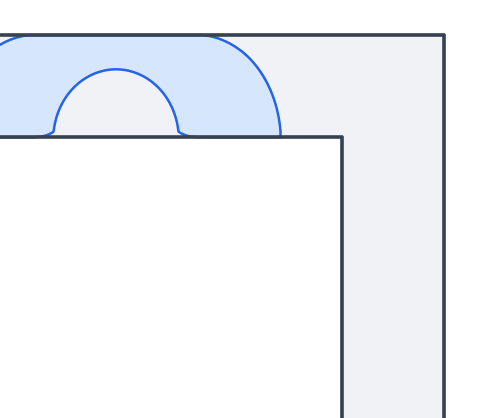

# Optimality, uniqueness and stability of Gerver's sofa, in Lean 4

[](https://github.com/vltanh/lean4-moving-sofa/actions/workflows/lean_action_ci.yml)
[](https://palomar-registry.org/entry.html?id=PALOMAR-2026-10-02-000008)

The moving sofa problem asks for the largest area of a shape that can be moved around the right-angled corner of
a hallway of unit width. This repository proves in Lean 4, with Mathlib, that Gerver's sofa, of area 2.21953…,

- **is optimal.** This is Jineon Baek's theorem ([arXiv:2411.19826v1](https://arxiv.org/abs/2411.19826v1)). His proof is formalized with the
  results from the literature that it uses and the structure of Gerver's sofa, which the paper states without proof.
- **is the only optimal sofa, up to rigid motions.** A rotation and a translation map every moving sofa of the same
  area onto it, and a translation alone suffices. Baek's paper does not prove this, and Google DeepMind's
  formal-conjectures lists it as open.
- **is stable.** A moving sofa whose area is ε less is, after a translation, within Euclidean Hausdorff distance
  `C√ε` of Gerver's sofa, and the exponent 1/2 cannot be improved.

A single estimate for Baek's upper bound, the *coercive certificate*, proves optimality and uniqueness again without
Baek's Theorem 1.1.1, and the stability proof rests on it; the uniqueness argument gives one more proof of
optimality. Through a bridge between formal-conjectures' definitions and Baek's, the optimality and the uniqueness
give formal-conjectures' statements, the open one included. ChatGPT Pro 6 wrote the arguments for uniqueness,
stability and the certificate for this repository; they have not been peer reviewed. Lean's kernel checks every
proof.



## Definitions

Lean's kernel checks the proofs, not that the statements mean what you intend, so read the definitions before
trusting the results. More on each: [docs/definitions.md](docs/definitions.md).

In Baek's definitions (namespace `Baek`), the plane is `ℝ × ℝ` and the hallway is the union of its horizontal side
`(-∞, 1] × [0, 1]` and its vertical side `[0, 1] × (-∞, 1]`. A moving sofa is a closed, connected set that a
continuous rotation and translation, starting at a translation, carry from the horizontal side to the vertical side
without leaving the hallway:

```lean
def IsMovingSofa (S : Set (ℝ × ℝ)) : Prop :=
  IsClosed S ∧ IsConnected S ∧
    ∃ (θ : ℝ → ℝ) (c : ℝ → ℝ × ℝ), ContinuousOn θ (Icc 0 1) ∧ ContinuousOn c (Icc 0 1) ∧
      θ 0 = 0 ∧ (∀ p ∈ S, rot (θ 0) p + c 0 ∈ horizSide) ∧
      (∀ s ∈ Icc (0 : ℝ) 1, ∀ p ∈ S, rot (θ s) p + c s ∈ hallway) ∧
      (∀ p ∈ S, rot (θ 1) p + c 1 ∈ vertSide)
```

Gerver's sofa follows Romik. Seen from the sofa, the hallway's inner corner traces a *rotation path* `x(t)`,
`0 ≤ t ≤ π/2`, made of five explicit curves whose 22 parameters solve Romik's equations; the sofa is the set of
points that stay in every moved hallway:

```lean
def shapeOfPath (x : ℝ → ℝ × ℝ) : Set (ℝ × ℝ) :=
  horizSide ∩ (⋂ t ∈ Icc 0 (π / 2), (fun p => x t + rot t p) '' hallway) ∩
    (fun p => x (π / 2) + rot (π / 2) p) '' vertSide

def gerverSofa (P : GerverParams) : Set (ℝ × ℝ) := shapeOfPath P.path
```

Formal-conjectures' definitions (namespace `FormalConjectures.MovingSofa`) use formal-conjectures' code: sofas in
`EuclideanSpace ℝ (Fin 2)` moved by continuous paths of isometries that start at the identity, the sofa constant as
the supremum of their areas, and Gerver's sofa built from Gerver's four constants. The Challenge at the root also
defines, in `Baek`, the terms of the stability theorems, and in `Certificate`, Baek's upper bound 𝒬, the enlarged
domain of triples and Gerver's cap.

## Results

More on each theorem: [docs/results.md](docs/results.md).

The repository has one Palomar entry, PALOMAR-2026-10-02-000008. Each version has a Challenge, which states
theorems and imports only Mathlib, and a Solution, which proves them.

| Version | Challenge and Solution | Statements | Proved through |
| --- | --- | --- | --- |
| 5, at the root, not registered yet | [`Challenge.lean`](Challenge.lean), [`Solution.lean`](Solution.lean) | 17: Baek's five, the bridge's three, formal-conjectures' four, three on stability and two on the certificate | the coercive certificate, without Baek's Theorem 1.1.1, his balance argument or the equality analysis of the first uniqueness proof |
| 1 to 4, registered; kept up to date in [`baek/`](baek) | [`baek/Challenge.lean`](baek/Challenge.lean), [`baek/Solution.lean`](baek/Solution.lean) | 12: all but the three on stability and the two on the certificate | Baek's Theorem 1.1.1 and the first uniqueness proof |

The main statements:

```lean
theorem Baek.gerver_sofa_optimal (P : GerverParams) (hP : P.IsSolution) (hPb : P.InBox) :
    IsMovingSofa (gerverSofa P) ∧ ∀ S, IsMovingSofa S → volume S ≤ volume (gerverSofa P)

theorem Baek.gerver_sofa_unique (P : GerverParams) (hP : P.IsSolution) (hPb : P.InBox)
    (S : Set (ℝ × ℝ)) (hS : IsMovingSofa S) (harea : volume S = volume (gerverSofa P)) :
    ∃ (θ : ℝ) (v : ℝ × ℝ), (fun p => rot θ p + v) '' S = gerverSofa P

theorem Baek.gerver_sofa_stable (P : GerverParams) (hP : P.IsSolution) (hPb : P.InBox) :
    ∃ C C' ε₀ : ℝ, 0 < C ∧ 0 < C' ∧ 0 < ε₀ ∧
      ∀ S, IsMovingSofa S → sofaDeficit P S < ε₀ →
        EuclideanClose (C * √(sofaDeficit P S)) (normalizedSofa P S) (gerverSofa P) ∧
        (volume (normalizedSofa P S ∆ gerverSofa P)).toReal ≤ C' * √(sofaDeficit P S)

theorem Certificate.coercive_certificate (P : Baek.GerverParams) (hP : P.IsSolution)
    (hPb : P.InBox) (K B D : Set (ℝ × ℝ)) (h : Certificate.InWideL P.φ K B D) :
    Certificate.upperQ P.φ K B D ≤ (volume (Baek.gerverSofa P)).toReal ∧
      Baek.EuclideanClose
        ((2 / cos P.φ) * √((volume (Baek.gerverSofa P)).toReal - Certificate.upperQ P.φ K B D))
        K (Certificate.shiftedReferenceCap (Certificate.gerverCap P) K)

theorem FormalConjectures.MovingSofa.volume_eq_sofaConstant_iff_congruent_gerversSofa
    (s : Set ℝ²) (hs : ∃ m, IsMovingSofa s m) :
    volume s = sofaConstant ↔ ∃ g : E(2), s = g '' gerversSofa
```

[docs/stability.md](docs/stability.md) and [docs/coercive.md](docs/coercive.md) explain the stability theorems and the certificate.

## Proof outline

[baek/proof/](baek/proof/README.md) writes out Baek's proof, the first uniqueness proof and the bridge as an illustrated
text, with each numbered result linked to its Lean declarations.

- **Optimality** ([Chapters 2 to 10](baek/proof/02-preliminaries.md)). A maximum sofa can be taken *monotone*: a convex
  *cap* minus the *niche* that the hallway's inner corner carves out of it. A *balanced* maximum sofa turns through
  a right angle and satisfies an *injectivity condition*. Under that condition Baek's upper bound 𝒬 is concave, and
  Gerver's sofa maximizes it and has area equal to it.
- **Uniqueness** ([Chapters 11 and 12](baek/proof/11-selection.md)). Baek's argument gives the right angle and the
  injectivity condition only to a maximum sofa chosen by compactness. Polygon maximizers of a penalized problem
  give them to every maximum sofa; equality in Baek's bound then makes its cap a translate of Gerver's.
- **Stability** ([docs/stability.md](docs/stability.md)). Baek's bound 𝒬 extends to caps with corners, and its deficit bounds
  the distance from the cap to Gerver's cap. Near Gerver's sofa a local form of Baek's area bound holds without the
  injectivity condition, and the margins of Gerver's sofa carry the bound from the cap to the sofa. Compactness and
  uniqueness bring every sofa of small deficit near Gerver's sofa.
- **The certificate** ([docs/coercive.md](docs/coercive.md)). On the enlarged domain of the stability proof, 𝒬 is at most the
  area of Gerver's sofa, and the gap bounds the distance from the cap to a translate of Gerver's cap. For a cap of
  maximal sofa area the gap is zero, since Gerver's cap competes with it; with the reductions of Baek's proof and of
  the first uniqueness proof, this gives optimality and uniqueness. At small deficit the same estimate gives
  stability.
- **The bridge** ([Chapter 13](baek/proof/13-bridge.md), [Appendix A](baek/proof/appendix-a.md)). A continuous path of isometries from the
  identity consists of rotations whose angle lifts to a continuous function, which matches the two notions of moving
  sofa. Gerver's four constants are unique and are read off Romik's parameters, and formal-conjectures' integrals
  are the coordinates of Romik's rotation path, which matches the two Gerver's sofas.

## The audit of Baek's paper

[baek/REPORT.md](baek/REPORT.md) audits the paper, read from its LaTeX source, and the formalization. Definition 3.2.5 uses the
parallelogram P_ω where the fan F_ω is meant, which makes Proposition 3.3.5 and Lemma 3.4.2 false as written. One
direction of Proposition 5.1.4 is false. Theorem 8.4.1 has no proof, the proof of Theorem 6.1.2 misreads Gerver,
and two statements need a hypothesis that the paper leaves out. Every result holds in its intended form, the main
theorem included, and every result that the proofs need is proved here; Section 9 of the report lists the few that
are not formalized. Twelve of the findings come from the notes of deancureton/MovingSofa.

The formal proofs follow Baek's, except at the steps that Section 7 of the report lists, each forced by an error or
gap of the paper, by mathematics that Mathlib lacks, or by the definition of the surface area measure. A route check
in CI compares the results that each formal proof uses with those that Baek's proof cites.

## The ambidextrous sofa

The ambidextrous variant of the problem asks for the largest shape that can be moved around the corner of
a unit-width hallway that turns right and also, from the same starting position, around one that turns
left. Romik constructed a candidate of area `1 + 4Y² + arctan Y = 1.64495…` in 2016, where `4Y³ + 3Y = 1`.
[lean4-ambidextrous-sofa](https://github.com/vltanh/lean4-ambidextrous-sofa) proves in Lean that Romik's
ambidextrous sofa is optimal and that it is the only optimal shape up to rotations and translations,
formalizing a manuscript written by ChatGPT Pro 6 from research notes that began in this repository (pull
request #3); that repository keeps the final manuscript in its archive. It uses this repository's
`MovingSofaOptimality` for Baek's theorem: every moving sofa has area at most 2.2199.

## Prior work

More, with references: [docs/prior-work.md](docs/prior-work.md).

Moser posed the problem in 1966. Hammersley found a sofa of area π/2 + 2/π ≈ 2.2074, and Gerver his sofa in 1992,
conjecturing that it is optimal; Romik derived Gerver's sofa from differential equations in 2018, and Kallus and
Romik proved by computer that the maximum is at most 2.37. Baek proved Gerver's conjecture in 2024. We know of no
earlier proof of the uniqueness. Two Lean formalizations of Baek's proof appeared shortly before this one,
[deancureton/MovingSofa](https://github.com/deancureton/MovingSofa) and [RuifengCao/sofa-formal](https://github.com/RuifengCao/sofa-formal); [baek/formalizations.md](baek/formalizations.md) compares the three.

## What's next

Baek's paper is still a preprint (arXiv version 1), reported in 2026 to be under review; no erratum or
counterexample has appeared. The report's [What's next](baek/REPORT.md#10-whats-next) lists later work, open directions and
simpler arguments for several of Baek's proofs.

## Layout

More on each file: [docs/layout.md](docs/layout.md).

```text
Challenge.lean, Solution.lean   version 5 of the Palomar entry: its statements and their proofs
comparator.json                 its Comparator configuration
formalization.yaml              its Palomar metadata
baek/                           the formalization that versions 1 to 4 registered, the audit of Baek's
                                paper (REPORT.md), the illustrated text (proof/) and the comparison of
                                the formalizations
MovingSofaOptimality/           Baek's paper
MovingSofaUniqueness/           the uniqueness, and the second proof of optimality
MovingSofaBridge/               the bridge to formal-conjectures, and the definitions the Challenges copy
MovingSofaStability/            the stability
MovingSofaExtremal/             the certificate route, and the proofs of version 5
docs/                           these pages, the credits and the manuscript
scripts/                        the audits, the documentation tools and the figures
```

## Verification

More on each check: [docs/verification.md](docs/verification.md).

```sh
lake exe cache get
lake build
lake env lean scripts/Audit.lean
python3 scripts/route_check.py check baek/paper_routes.tsv --accept baek/route_differences.tsv
lake env lean scripts/AuditMaximizerRoute.lean
lake env lean scripts/AuditCoerciveRoute.lean
lake env lake comparator --config=comparator.json
lake env lake comparator --config=baek/comparator.json
```

Lean and Mathlib are pinned at `v4.35.0-rc3`. The build's only `sorry`s are the statements of the two Challenges.
The audit checks that every declaration of the libraries, and every theorem that Comparator checks, uses only the
axioms [`propext`](https://leanprover-community.github.io/mathlib4_docs/Init/Core.html#propext), [`Classical.choice`](https://leanprover-community.github.io/mathlib4_docs/Init/Prelude.html#Classical.choice) and [`Quot.sound`](https://leanprover-community.github.io/mathlib4_docs/Init/Prelude.html#Quot.sound); the route check, that each proof of a result of Baek's paper
uses what Baek's proof cites, up to recorded differences; the two route audits, that the second proof of optimality
avoids Baek's Theorem 1.1.1, and that the proofs of version 5 avoid it, his balance argument, and the main
theorem and equality analysis of the first uniqueness proof. Comparator checks that each Solution proves exactly
its Challenge. GitHub Actions runs all of these but Comparator on every push, and also checks the Challenges'
copies of the definitions and the documentation.

## Palomar

The repository has one entry in [Palomar](https://palomar-registry.org),
[PALOMAR-2026-10-02-000008](https://palomar-registry.org/entry.html?id=PALOMAR-2026-10-02-000008). Palomar checks each version's proofs against its Challenge; the
Comparator configuration selects the theorems, and the metadata records provenance, authorship and AI use.

- **Versions 1 to 4** were registered from the root of the repository: version 1 registers the optimality
  (`d0b42d2`), version 2 adds the uniqueness (`cf4feff`), version 3 the bridge (`eb93296`) and version 4 the proofs
  that follow Baek's arguments (`16653ae`). Their Challenge and Solution, kept up to date, are in [`baek/`](baek), with
  their Comparator configuration and metadata, so that Comparator still checks them; [`baek/`](baek) is not registered on
  its own.
- **Version 5** ([`Challenge.lean`](Challenge.lean), [`Solution.lean`](Solution.lean), [`comparator.json`](comparator.json), [`formalization.yaml`](formalization.yaml)) is not registered yet.

[`.github/workflows/palomar_preflight.yml`](.github/workflows/palomar_preflight.yml) runs Palomar's preflight on the root, and on [`baek/`](baek) with inputs.

## License

Apache-2.0 ([`LICENSE`](LICENSE)), as for Mathlib.

## Credits

- The-Anh Vu-Le directed the work. Claude Opus 5.5 (Anthropic), in Claude Code, following the
  [formalize-math-paper](https://github.com/vltanh/formalize-math-paper) skill, formalized Baek's paper and wrote the audit and the documentation; Claude
  Sonnet 5.5 wrote the first version of the manuscript.
- ChatGPT Pro 6 (OpenAI) wrote the informal uniqueness argument and uncompiled Lean drafts of the uniqueness proof,
  the bridge, a second proof of optimality, the stability proof and the coercive route (pull requests #1, #5, #8
  and #9). Claude Opus 5.5 made the drafts compile and completed them; the second proof of optimality compiled
  unchanged, and Claude Opus 5.5 merged it and extended its audit.
- No person has reviewed the proofs, the statements or the definitions; Lean's kernel checks every proof. The work
  took nineteen rounds between 1 and 7 October 2026, with up to 26 sub-agents in a round: [docs/CREDITS.md](docs/CREDITS.md).
