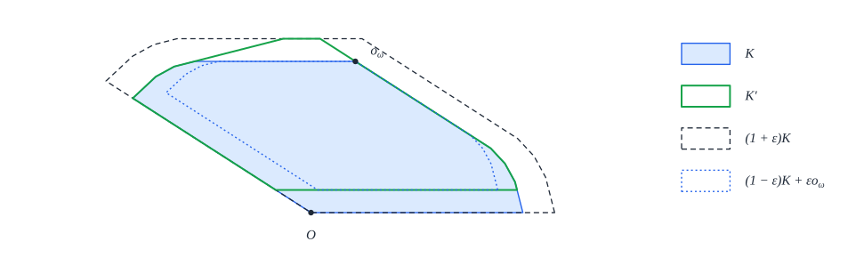

# 11. Uniqueness I: approximating a maximizing cap

[Contents](README.md) · [← 10. Gerver's sofa](10-gerver.md) · [12. Uniqueness II: every maximum is Gerver's sofa →](12-uniqueness.md)

This chapter and the next prove that Gerver's sofa $G$ is the only moving sofa of maximum area up
to a rotation and a translation: a rotation about the origin followed by a translation maps every
moving sofa $S$ with $|S| = |G|$ onto $G$, as a set
([Theorem 12.1](12-uniqueness.md#theorem-121-uniqueness-of-gervers-sofa)). Baek's paper does not
prove this. The argument is that of note 20
([`docs/archive/uniqueness/20-complete-paper-proof.md`](../archive/uniqueness/20-complete-paper-proof.md)), an informal proof in six propositions,
written for this formalization by ChatGPT Pro 6 and not peer reviewed
([§1.3](README.md#13-background)); the library [`MovingSofaUniqueness/`](../../MovingSofaUniqueness) formalizes it. The two chapters follow the formal proof; a
remark marks each place where it takes a different route from note 20.

Baek's optimality proof works with a *balanced maximum cap*, a limit of maximum polygon caps chosen
by compactness. Uniqueness needs the properties of such a cap for the cap of the *given* sofa $S$,
which need not be such a limit (§11.1). This chapter replaces Baek's selection by one that keeps a
given cap $K_*$ maximizing the sofa area $\mathcal{A}_\omega$: at stage $n$, a polygon cap
maximizes the polygon sofa area minus a weighted squared penalty on the differences between its
support function and that of $K_*$ at dyadic normals, and these polygon caps converge to $K_*$
(Proposition 11.13, note 20's Proposition 1).

The penalty spoils the balance $\sigma = \tau$ of Baek's maximum polygon caps only slightly. Raising
one defining height of a penalized maximizer, or moving one of its two strips, bounds the defect
$\sigma - \tau$ by a multiple of the distance to $K_*$ (Propositions 11.16 and 11.19, note 20's
Proposition 2). In the limit this gives the pinned bounds $w_{K_*}^\circ \le \sigma_{K_*}(\pi/2)$
and $z_{K_*}^\circ \le \sigma_{K_*}(\omega)$ for $K_*$ itself (Proposition 11.23), from which
[Chapter 12](12-uniqueness.md) obtains the right-angle motion.

## 11.1 The given maximizer

Baek's proof of Theorem 1.1.1 ([Chapter 9](09-optimality.md)) bounds the area of every moving sofa
by that of a balanced maximum sofa. For each angle $\omega$, Baek's Theorem 3.5.2 takes maximum
polygon caps $K_i$ with the uniform angle sets $\Theta_{\omega, 2^i}$ and, by the Blaschke selection
theorem, a subsequence that converges to a cap $K_\omega$; this cap maximizes $\mathcal{A}_\omega$
(Theorem 3.5.5). Each $K_i$ is balanced, $\sigma_{K_i}(t) = \tau_{K_i}(t)$ at its defining normals
(Theorem 3.4.9), and $K_\omega$ inherits two consequences in the limit: the pinned bounds of
Theorem 4.1.4, which make the rotation angle $\pi/2$ (Theorems 4.2.5 and 1.5.2), and, at the right
angle, the injectivity condition (Theorem 6.1.1), which makes Baek's upper bound $\mathcal{Q}$
applicable ([Chapters 4](04-balanced.md), [5](05-rotation-angle.md) and
[7](07-injectivity.md)).

For uniqueness the same two properties are needed for the cap of the given sofa $S$, and Baek's
argument does not provide them. Note 03
([`docs/archive/uniqueness/03-global-reduction-obstructions.md`](../archive/uniqueness/03-global-reduction-obstructions.md)) records three obstructions, which note 20 is
designed to avoid.

1. *Exact maximizers do not select a given maximizer.* A cap that maximizes $\mathcal{A}_\omega$
   need not be a limit of maximum polygon caps, although the polygon objectives approximate
   $\mathcal{A}_\omega$ from above. On $[0, 1]$, the functions $F_n(x) = x/n$ decrease uniformly to
   $F = 0$; every point maximizes $F$, but every $F_n$ has its only maximum at $1$ (Figure 11.1). A
   penalty that vanishes at the chosen maximizer $x^*$ repairs this: the maxima of
   $F_n(x) - (x - x^*)^2$ converge to $x^*$. Sections 11.2 to 11.4 make this repair for caps.
2. *Comparing areas does not compare sets.* Baek's proof compares the area of $S$ with that of a
   balanced maximum sofa, which is not shown to contain $S$. The proof of Theorem 12.1 replaces each
   such comparison by a containment: a translate of $S$ lies in its monotonization, a rotated copy
   of that lies in a second monotonization, and that one is a translate of $G$.
3. *Equal areas do not make equal sets.* The unit square $E$ and $E \cup ([1, 2] \times \lbrace 0 \rbrace)$ are closed, connected and of the same area, and the first is a proper subset of the
   second ([Figure 12.7](12-uniqueness.md)). The last step of the proof therefore uses that $G$ is
   the closure of its interior
   ([Proposition 12.22](12-uniqueness.md#proposition-1222-regular-closedness-note-20-proposition-6)).


*Figure 11.1.* Note 03's example. Left: the functions $F_n(x) = x/n$ decrease uniformly to $F = 0$
on $[0, 1]$, and each attains its maximum only at $x = 1$ (dots), although every point maximizes
$F$. Right: the penalized functions $G_n(x) = F_n(x) - (x - x^*)^2$ attain their maxima at
$x^* + \frac1{2n}$, which converge to the chosen maximizer $x^* = 0.3$.

The maximum of $\mathcal{A}_\omega$ is the area of Gerver's sofa, so a cap is maximizing as soon as
it attains that value; and the cap of the monotonization of $S$ attains it.

### Definition 11.1 (maximizing cap)

Let $\omega \in (0, \pi/2]$. A cap $K \in \mathcal{K}^\mathrm{c}_\omega$ *maximizes*
$\mathcal{A}_\omega$ if $\mathcal{A}_\omega(C) \le \mathcal{A}_\omega(K)$ for every cap
$C \in \mathcal{K}^\mathrm{c}_\omega$.

*Lean: [`MovingSofaUniqueness.IsMaxCap`](../../MovingSofaUniqueness/Main.lean#L37).*

### Lemma 11.2 (the maximum value)

Let $\omega \in (0, \pi/2]$. Every cap $K \in \mathcal{K}^\mathrm{c}_\omega$ has
$\mathcal{A}_\omega(K) \le |G|$. Consequently a cap with $\mathcal{A}_\omega(K) = |G|$ maximizes
$\mathcal{A}_\omega$.

*Proof.* Baek's Theorem 3.5.6 gives a balanced maximum cap $B$ of angle $\omega$ such that
$B \setminus \mathcal{N}(B)$ is a monotone sofa with cap $B$. By Theorem 3.5.5,
$\mathcal{A}_\omega(K) \le \mathcal{A}_\omega(B)$, and by Theorem 2.5.10,
$\mathcal{A}_\omega(B) = |B \setminus \mathcal{N}(B)|$, the area of a moving sofa, which is at most
$|G|$ by Theorem 1.1.1. $\square$

The balanced maximum cap enters here only through the value of the maximum; the cap $K$ is not
replaced by $B$.

*Lean: [`MovingSofaUniqueness.cap_area_le_gerver`](../../MovingSofaUniqueness/Main.lean#L58), [`MovingSofaUniqueness.isMaxCap_of_area_eq`](../../MovingSofaUniqueness/Main.lean#L68),
[`MovingSofaUniqueness.area_le_gerver`](../../MovingSofaUniqueness/Main.lean#L50).*

### Lemma 11.3 (the monotonization of a maximizing sofa)

Let $S$ be a moving sofa with rotation angle $\omega \in (0, \pi/2]$ and $|S| = |G|$. There are a
vector $v$ and a monotone sofa $T$ of angle $\omega$ with $S + v \subseteq T$ and $|T| = |G|$. The
cap $\mathcal{C}(T)$ of every monotone sofa $T$ of angle $\omega$ with $|T| = |G|$ maximizes
$\mathcal{A}_\omega$.

*Proof.* By Baek's Proposition 2.3.1 a translate $S + v$ of $S$ is in standard position, and it
moves with the same angle. By Theorem 2.3.2 its monotonization $T = \mathcal{I}(S + v)$ is a moving
sofa of angle $\omega$ that contains $S + v$, so $T$ is a monotone sofa, and
$|G| = |S + v| \le |T| \le |G|$, the last inequality by Theorem 1.1.1. For the second claim,
$\mathcal{C}(T)$ is a cap (Theorem 2.4.1) with
$\mathcal{A}_\omega(\mathcal{C}(T)) = |T| = |G|$ (Theorem 2.5.10), and Lemma 11.2 applies.
$\square$

*Lean: [`MovingSofaUniqueness.maximal_envelope`](../../MovingSofaUniqueness/Main.lean#L135), [`MovingSofaUniqueness.own_cap_isMax`](../../MovingSofaUniqueness/Main.lean#L154).*

The cap of $T$ is the *given* maximizing cap of the rest of the proof. The following table lists
the steps that turn it into a translate of Gerver's cap; [Chapter 12](12-uniqueness.md) assembles
them.

| Step | Note 20 | Here | Lean |
| --- | --- | --- | --- |
| Penalized polygon caps converge to a given maximizing cap | Proposition 1 | Proposition 11.13 | [`exists_selectedCapSequence`](../../MovingSofaUniqueness/Selection.lean#L956) |
| Their variation defects are small, (11) and (12) | Proposition 2 | Propositions 11.16, 11.19, Corollary 11.21 | [`floating_defect_le`](../../MovingSofaUniqueness/Variation.lean#L284), [`pinned_defect_le`](../../MovingSofaUniqueness/Variation.lean#L599) |
| The pinned bounds (19) of the given cap | Proposition 4 | Proposition 11.23 | [`pinned_bounds_of_maximal_positive`](../../MovingSofaUniqueness/Variation.lean#L831) |
| Curvature bounds (16), injectivity | Proposition 3 | Propositions 12.6, 12.9, Corollary 12.10 | [`curvature_of_maximal_positive`](../../MovingSofaUniqueness/Curvature.lean#L1470), [`isKi_of_maximal_area`](../../MovingSofaUniqueness/Main.lean#L88) |
| A right-angle motion | Proposition 4 | Proposition 12.13 | [`maximal_monotone_has_right_angle`](../../MovingSofaUniqueness/Main.lean#L164) |
| Equality in $\mathcal{Q}$ gives Gerver's cap | Proposition 5 | Proposition 12.19 | [`ki_sofa_eq_gerver_translate`](../../MovingSofaUniqueness/Main.lean#L103) |
| $G$ is the closure of its interior | Proposition 6 | Proposition 12.22 | [`gerver_regularClosed`](../../MovingSofaUniqueness/RegularClosed.lean#L349) |
| The theorem | Theorem | Theorem 12.1 | [`image_eq_gerver_of_volume_eq`](../../MovingSofaUniqueness/Main.lean#L233) |

For the rest of this chapter, $\omega \in (0, \pi/2]$ is fixed, and $K_*$ is a cap of angle
$\omega$ that maximizes $\mathcal{A}_\omega$ with $\mathcal{A}_\omega(K_*) > 0$. The cap of
Lemma 11.3 qualifies, as $|G| \ge 2.2$ ([Chapter 10](10-gerver.md)). The positivity keeps the
penalized maximizers in a bounded region (Proposition 11.10).

## 11.2 Penalties at dyadic samples

Recall from [Chapter 4](04-balanced.md) (Baek's §3.2–3.4): an angle set $\Theta$ is a finite
nonempty subset of $(0, \omega)$; its *defining normals* are
$\Theta^\diamond = \Theta \cup (\Theta + \pi/2) \cup \lbrace \omega, \pi/2 \rbrace$; a polygon cap
$C \in \mathcal{K}^\mathrm{c}_\Theta$ is a cap whose edges have normals in
$\Theta^\diamond \cup \lbrace \omega + \pi, 3\pi/2 \rbrace$; the polygon cap
$\mathcal{C}_\Theta(K)$ is circumscribed about a cap $K$; and
$\mathcal{A}_\Theta(C) = |C| - |\mathcal{N}_\Theta(C)|$, with the polygon niche
$\mathcal{N}_\Theta(C) = F_\omega \cap \bigcup_{t \in \Theta} Q_C^-(t)$. (Baek's Definition 3.2.5
writes the parallelogram $P_\omega$ where the fan $F_\omega$ is meant; REPORT.md, E6.) For every cap
$K$, $\mathcal{A}_\omega(K) \le \mathcal{A}_\Theta(K)$ (Baek's Theorem 3.2.3).

For $k \ge 0$ let

```math
\Theta^{(k)} = \Theta_{\omega, 2^{k+1}} = \lbrace i\omega/2^{k+1} : 0 < i < 2^{k+1} \rbrace ,
```

the uniform angle set with $2^{k+1}$ intervals (Baek's Definition 3.5.1), whose elements are the
*dyadic angles of level* $k$. These sets increase with $k$, and their union is dense in
$[0, \omega]$.

### Definition 11.4 (support samples and their penalty)

Let $\Theta$ be an angle set. *Support samples* for $\Theta$ are finitely many normals
$s_i \in \Theta^\diamond$ with weights $w_i \ge 0$, $i \in I$; a normal may occur several times.
Their *total weight* is $W = \sum_i w_i$, and their *weight at the normal* $t$ is
$w(t) = \sum_{s_i = t} w_i$. For convex bodies $K$ and $K_*$, the *penalty* of $K$ with target
$K_*$ is

```math
P(K) = \sum_{i \in I} w_i \bigl(h_K(s_i) - h_{K_*}(s_i)\bigr)^2 .
```

*Lean: [`SupportSamples`](../../MovingSofaUniqueness/Selection.lean#L192), [`SupportSamples.penalty`](../../MovingSofaUniqueness/Selection.lean#L211), [`SupportSamples.totalWeight`](../../MovingSofaUniqueness/Selection.lean#L207),
[`SupportSamples.atNormal`](../../MovingSofaUniqueness/Selection.lean#L216), [`sampledPenalty`](../../MovingSofaUniqueness/Selection.lean#L43).*

### Lemma 11.5 (changing the supports)

Let $\eta \ge 0$ and let $K$ satisfy $|h_K(s_i) - h_{K_*}(s_i)| \le \eta$ at every sample. Let $K'$
be a convex body.

1. If $|h_{K'}(s_i) - h_K(s_i)| \le r$ at every sample, then
   $|P(K') - P(K)| \le W(2\eta r + r^2)$.
2. If $h_{K'}(s_i) = h_K(s_i)$ at every sample with $s_i \ne t$, and
   $|h_{K'}(t) - h_K(t)| \le r$, then $|P(K') - P(K)| \le w(t)(2\eta r + r^2)$.

*Proof.* For real numbers $a, b, c$,
$(b - c)^2 - (a - c)^2 = 2(a - c)(b - a) + (b - a)^2$, whose absolute value is at most
$2\eta r + r^2$ when $|a - c| \le \eta$ and $|b - a| \le r$. Multiply by $w_i$ and sum over the
samples; in (2) only the samples at $t$ contribute. $\square$

*Lean: [`abs_square_increment_le`](../../MovingSofaUniqueness/Selection.lean#L59), [`sampledPenalty_change_bound`](../../MovingSofaUniqueness/Selection.lean#L79),
[`sampledPenalty_change_on_normal`](../../MovingSofaUniqueness/Selection.lean#L117), [`SupportSamples.penalty_change_uniform`](../../MovingSofaUniqueness/Selection.lean#L290),
[`SupportSamples.penalty_change_one`](../../MovingSofaUniqueness/Selection.lean#L276).*

### Definition 11.6 (persistent dyadic samples)

The *dyadic samples of stage* $n$ consist, for every level $m \le n$ and every
$t \in \Theta^{(m)}$, of one sample at $t$ and one at $t + \pi/2$, each of weight

```math
w_m = \frac{(1/2)^{m+1}}{2\,\lvert \Theta^{(m)} \rvert} = \frac{(1/2)^{m+1}}{2\,(2^{m+1} - 1)} .
```

They are support samples for $\Theta^{(n)}$, since $\Theta^{(m)} \subseteq \Theta^{(n)}$. Write
$P_n$ for their penalty with target $K_*$. An angle of level $m$ also lies in every later level, so
at stage $n$ it carries one sample from each level between its first one and $n$ (Figure 11.2).

*Lean: [`dyadicSamples`](../../MovingSofaUniqueness/Selection.lean#L346), [`dyadicLevelWeight`](../../MovingSofaUniqueness/Selection.lean#L329), [`DyadicSampleIndex`](../../MovingSofaUniqueness/Selection.lean#L341), [`dyadicPenalty`](../../MovingSofaUniqueness/Selection.lean#L405).*

![Two panels. Top: Gerver's cap, a convex region with a flat top and rounded ends, with outward normal arrows at the points where its support function is sampled, thick at the normals π/4 and 3π/4 of level 0 and thin at the normals of level 1, and a dashed polygon circumscribed about the cap along the supporting lines at these normals. Bottom: four rows of dots on an axis of normal angles from 0 to π, one row per level 0 to 3; row m has dots at the dyadic angles of level m and at the same angles plus π/2, with dots that shrink from row to row, and the label total 1/2, 1/4, 1/8, 1/16 on the right](figures/11-selection/samples.svg)

*Figure 11.2.* The dyadic samples at the right angle. Top: Gerver's cap $\mathcal{C}(G)$, the
outward normals $u_s$ at which its support function is sampled at levels 0 (thick) and 1 (thin),
and the polygon $\mathcal{C}_{\Theta^{(1)}}(\mathcal{C}(G))$ circumscribed about the cap at these
normals (dashed), whose penalty is zero. Bottom: the sampled normals of levels 0 to 3. The samples
of level $m$ have total weight $(1/2)^{m+1}$, and keep their weights at every later stage.

### Lemma 11.7 (the dyadic penalty)

1. The total weight of the dyadic samples of stage $n$ is $1 - (1/2)^{n+1} \le 1$.
2. *Persistence.* If $m \le n$ and $t \in \Theta^{(m)}$, then every convex body $K$ satisfies
   $w_m \bigl(h_K(t) - h_{K_*}(t)\bigr)^2 \le P_n(K)$ and
   $w_m \bigl(h_K(t + \pi/2) - h_{K_*}(t + \pi/2)\bigr)^2 \le P_n(K)$.
3. *Recovery.* The polygon cap $R_n = \mathcal{C}_{\Theta^{(n)}}(K_*)$ circumscribed about $K_*$
   has $P_n(R_n) = 0$, and

   ```math
   \mathcal{A}_\omega(K_*) \le \mathcal{A}_{\Theta^{(n)}}(R_n) - P_n(R_n) .
   ```

*Proof.* (1) Level $m$ has $2|\Theta^{(m)}|$ samples of weight $w_m$, of total weight
$(1/2)^{m+1}$, and $\sum_{m=0}^n (1/2)^{m+1} = 1 - (1/2)^{n+1}$. (2) The two terms belong to $P_n$,
whose terms are nonnegative. (3) $R_n$ contains $K_*$ and lies in the supporting half-planes of
$K_*$ at the normals of $\Theta^\diamond$ (Baek's Definition 3.2.4 and Proposition 3.2.1), so
$h_{R_n} = h_{K_*}$ on $\Theta^\diamond$ and every term of $P_n(R_n)$ vanishes. Finally
$\mathcal{A}_\omega(K_*) \le \mathcal{A}_\Theta(K_*) = \mathcal{A}_\Theta(R_n)$ by Baek's
Theorem 3.2.3 and Propositions 3.2.1 and 3.2.2. $\square$

*Lean: [`dyadic_totalWeight`](../../MovingSofaUniqueness/Selection.lean#L378), [`dyadic_totalWeight_le_one`](../../MovingSofaUniqueness/Selection.lean#L399), [`persistent_sample_first`](../../MovingSofaUniqueness/Selection.lean#L414),
[`persistent_sample_second`](../../MovingSofaUniqueness/Selection.lean#L426), [`SupportSamples.penalty_recovery_zero`](../../MovingSofaUniqueness/Selection.lean#L240),
[`SupportSamples.recovery_objective_ge`](../../MovingSofaUniqueness/Selection.lean#L251), [`dyadic_recovery_ge`](../../MovingSofaUniqueness/Selection.lean#L437).*

## 11.3 Penalized maximizers

### Definition 11.8 (penalized maximizer)

Given support samples for $\Theta$ and a target $K_*$, a polygon cap
$K \in \mathcal{K}^\mathrm{c}_\Theta$ is a *penalized maximizer* if

```math
\mathcal{A}_\Theta(C) - P(C) \le \mathcal{A}_\Theta(K) - P(K) \qquad \text{for every } C \in \mathcal{K}^\mathrm{c}_\Theta .
```

*Lean: [`IsPenalizedMax`](../../MovingSofaUniqueness/Selection.lean#L534).*

### Lemma 11.9 (two orthogonal samples bound a polygon cap)

Let $t \in \Theta$, $q > 0$ and $c \ge 0$, and let a polygon cap $K \in \mathcal{K}^\mathrm{c}_\Theta$
satisfy $q\bigl(h_K(s) - h_{K_*}(s)\bigr)^2 \le c$ for $s = t$ and for $s = t + \pi/2$. Then
$K \subseteq [-R, R] \times [0, 1]$, where

```math
R = \frac{H}{\sin t} + \frac{H}{\cos t}, \qquad H = |h_{K_*}(t)| + |h_{K_*}(t + \pi/2)| + \frac cq + 1 .
```

*Proof.* From $x^2 \le c/q$ follows $|x| \le c/q + 1$, so $h_K(t) \le H$ and
$h_K(t + \pi/2) \le H$. A point $(x, y) \in K$ has $0 \le y \le 1$, as $K$ is a cap. Since
$t \in (0, \pi/2)$, the inequality $x\cos t + y \sin t \le H$ gives $x \le H/\cos t$, and
$-x \sin t + y \cos t \le H$ gives $-x \le H/\sin t$. $\square$

*Lean: [`polygon_subset_sampleBox`](../../MovingSofaUniqueness/Selection.lean#L479), [`sampleBoxRadius`](../../MovingSofaUniqueness/Selection.lean#L465).*

At the right angle a polygon cap can slide horizontally without changing $\mathcal{A}_\Theta$; the
penalty at two orthogonal normals stops it. Note 20 uses an artificial box at the right angle
instead.

### Proposition 11.10 (penalized maximizers exist)

Let support samples for $\Theta$ have samples of positive weight at $t$ and at $t + \pi/2$ for some
$t \in \Theta$, and let some polygon cap $R_0 \in \mathcal{K}^\mathrm{c}_\Theta$ satisfy
$\mathcal{A}_\Theta(R_0) - P(R_0) > 0$. Then a penalized maximizer exists. In particular, at every
stage $n$ the dyadic samples with target $K_*$ have a penalized maximizer $K_n$; it satisfies

```math
\mathcal{A}_\omega(K_*) \le \mathcal{A}_{\Theta^{(n)}}(K_n) - P_n(K_n) ,
```

and all the $K_n$ lie in one box $[-R, R] \times [0, 1]$.

*Proof.* Write $F = \mathcal{A}_\Theta - P$. By Baek's Lemma 3.4.2 there is $c > 0$ such that every
polygon cap $C$ of an angle set of angle $\omega$ that contains $t$, with $\mathcal{A}_\Theta(C) > 0$,
has width at most $c$ along $u_0$. If $F(C) > 0$, then $\mathcal{A}_\Theta(C) > 0$, and since $C$
lies in a horizontal strip of height one, $P(C) < \mathcal{A}_\Theta(C) \le |C| \le c$. Hence
$F \le c$, and the supremum $M$ of $F$ is positive and finite. Take polygon caps $C_j$ with
$F(C_j) > 0$ and $F(C_j) \to M$. Their penalties are at most $c$, so by Lemma 11.9, with $q$ the
smaller of the two positive weights, all $C_j$ lie in one box. Their supports at the finitely many
normals of $\Theta^\diamond$ are then bounded, and along a subsequence they converge to values
$h_\infty$. The polygon cap $C_\infty = \mathcal{C}_\Theta(h_\infty)$ has these supports on
$\Theta^\diamond$, and for every $\varepsilon > 0$, eventually $|C_j| \le |C_\infty| + \varepsilon$
and $|\mathcal{N}_\Theta(C_\infty)| - \varepsilon \le |\mathcal{N}_\Theta(C_j)|$ (the compactness
argument of Baek's Theorem 3.4.3). The penalty depends continuously on the supports at the sample
normals, so $F(C_\infty) \ge M$, and $C_\infty$ is a penalized maximizer.

For the dyadic samples, $\Theta^{(0)} = \lbrace \omega/2 \rbrace$, and the samples of level 0, at
$\omega/2$ and $\omega/2 + \pi/2$, have weight $w_0 = 1/4$ at every stage. By Lemma 11.7 (3), the
polygon cap $R_n$ has $F(R_n) \ge \mathcal{A}_\omega(K_*) > 0$, so a penalized maximizer $K_n$ exists,
and $F(K_n) \ge F(R_n) \ge \mathcal{A}_\omega(K_*)$. As above, $P_n(K_n) \le c$, with
$c = c_{\omega, \omega/2}$ independent of $n$, since $\omega/2$ lies in every $\Theta^{(n)}$. By
persistence (Lemma 11.7 (2)) and Lemma 11.9 with $q = w_0$, all the $K_n$ lie in one box. $\square$

*Lean: [`exists_penalizedMax`](../../MovingSofaUniqueness/Selection.lean#L556), [`penalty_and_area_le_of_positive`](../../MovingSofaUniqueness/Selection.lean#L541), [`exists_dyadic_penalizedMax`](../../MovingSofaUniqueness/Selection.lean#L883),
[`selected_objective_ge`](../../MovingSofaUniqueness/Selection.lean#L903), [`selected_sequence_bounded`](../../MovingSofaUniqueness/Selection.lean#L914), [`lemma3_4_2`](../../MovingSofaOptimality/Balanced/MaximumPolygonCap.lean#L2221), [`mpc_limit_polycap`](../../MovingSofaOptimality/Balanced/MaximumPolygonCap.lean#L2515).*

## 11.4 Convergence to the given cap

### Lemma 11.11 (the polygon objective in the limit)

Let $k_n$ be strictly increasing, and let polygon caps $K_n \in \mathcal{K}^\mathrm{c}_{\Theta^{(k_n)}}$
lie in a common box $[-R, R] \times [0, 1]$ and converge in the Hausdorff distance to a convex body
$L$. Then for every $\varepsilon > 0$, eventually

```math
\mathcal{A}_{\Theta^{(k_n)}}(K_n) \le \mathcal{A}_\omega(L) + \varepsilon .
```

*Proof.* $\mathcal{A}_{\Theta^{(k_n)}}(K_n) = |K_n| - |\mathcal{N}_{\Theta^{(k_n)}}(K_n)|$ by Baek's
Theorem 3.2.3. The area of convex bodies is upper semicontinuous in the Hausdorff distance, so
eventually $|K_n| \le |L| + \varepsilon/2$. A point of $\mathcal{N}(L)$ lies in an open inner
quadrant $Q_L^-(t)$, $t \in (0, \omega)$; since the dyadic angles are dense and nested and the
support functions converge uniformly, it lies in $\mathcal{N}_{\Theta^{(k_n)}}(K_n)$ for all large
$n$. These niches lie in the bounded box $[-R, R] \times [0, 2R]$, so by Fatou's lemma eventually
$|\mathcal{N}(L)| \le |\mathcal{N}_{\Theta^{(k_n)}}(K_n)| + \varepsilon/2$. $\square$

*Lean: [`dyadic_objective_limsup`](../../MovingSofaUniqueness/Selection.lean#L760), [`niche_subset_box`](../../MovingSofaUniqueness/Selection.lean#L693), [`polyNiche_subset_box`](../../MovingSofaUniqueness/Selection.lean#L752), [`mpc_area_usc`](../../MovingSofaOptimality/Balanced/MaximumPolygonCap.lean#L390),
[`mpc_area_lsc`](../../MovingSofaOptimality/Balanced/MaximumPolygonCap.lean#L402), [`mpc_niche_eventually`](../../MovingSofaOptimality/Balanced/BalancedMaximumSofa.lean#L523).*

### Lemma 11.12 (dyadic supports determine a cap)

Two caps $K, L \in \mathcal{K}^\mathrm{c}_\omega$ with $h_K(t) = h_L(t)$ and
$h_K(t + \pi/2) = h_L(t + \pi/2)$ for every dyadic angle $t$ of every level are equal.

*Proof.* Support functions are continuous and the dyadic angles are dense in $[0, \omega]$, so
$h_K = h_L$ on $J_\omega = [0, \omega] \cup [\pi/2, \omega + \pi/2]$; also
$h_K = h_L = 0$ at $\omega + \pi$ and $3\pi/2$. A cap is the intersection of its supporting
half-planes at the normals of $J_\omega \cup \lbrace \omega + \pi, 3\pi/2 \rbrace$
(Baek's Definition 2.4.1). $\square$

*Lean: [`caps_eq_of_dyadic_supports`](../../MovingSofaUniqueness/Selection.lean#L841), [`eqOn_of_dyadic_eq`](../../MovingSofaUniqueness/Selection.lean#L798), [`caps_eq_of_upper_supports`](../../MovingSofaUniqueness/Selection.lean#L819).*

### Proposition 11.13 (selection; note 20, Proposition 1)

Let $\omega \in (0, \pi/2]$, and let $K_*$ be a cap of angle $\omega$ that maximizes
$\mathcal{A}_\omega$ with $\mathcal{A}_\omega(K_*) > 0$. There are a strictly increasing sequence
$(k_n)$, polygon caps $K_n \in \mathcal{K}^\mathrm{c}_{\Theta^{(k_n)}}$ and $R \ge 0$ such that

1. $K_n$ is a penalized maximizer for the dyadic samples of stage $k_n$ with target $K_*$;
2. $K_n \subseteq [-R, R] \times [0, 1]$ for every $n$;
3. $K_n \to K_*$ in the Hausdorff distance.

*Proof.* **Step 1. Penalized maximizers.** Proposition 11.10 gives a penalized maximizer at every
stage, with objective at least $\mathcal{A}_\omega(K_*)$, all in one box $[-R, R] \times [0, 1]$.

**Step 2. A limit.** By the Blaschke selection theorem a subsequence $K_n$, at the stages $k_n$,
converges in the Hausdorff distance to a convex body $L$, and a Hausdorff limit of polygon caps of
angle $\omega$ is a cap of angle $\omega$ (as in Baek's Theorem 3.5.2; REPORT.md, E8).

**Step 3. The penalties vanish.** By Proposition 11.10, Lemma 11.11 and the maximality of $K_*$,
for every $\varepsilon > 0$ and all large $n$,

```math
0 \le P_{k_n}(K_n) \le \mathcal{A}_{\Theta^{(k_n)}}(K_n) - \mathcal{A}_\omega(K_*) \le \mathcal{A}_\omega(L) + \varepsilon - \mathcal{A}_\omega(K_*) \le \varepsilon .
```

**Step 4. The limit is $K_*$.** Let $t$ be a dyadic angle of level $m$. For $k_n \ge m$, persistence
(Lemma 11.7 (2)) gives
$w_m \bigl(h_{K_n}(t) - h_{K_*}(t)\bigr)^2 \le P_{k_n}(K_n) \to 0$, while
$h_{K_n}(t) \to h_L(t)$. So $h_L(t) = h_{K_*}(t)$, and in the same way
$h_L(t + \pi/2) = h_{K_*}(t + \pi/2)$. By Lemma 11.12, $L = K_*$. $\square$

*Lean: [`exists_selectedCapSequence`](../../MovingSofaUniqueness/Selection.lean#L956), [`SelectedCapSequence`](../../MovingSofaUniqueness/Selection.lean#L943), [`selected_sequence_bounded`](../../MovingSofaUniqueness/Selection.lean#L914),
[`mpc_blaschke`](../../MovingSofaOptimality/Balanced/BalancedMaximumSofa.lean#L223), [`mpc_limit_isCap`](../../MovingSofaOptimality/Balanced/BalancedMaximumSofa.lean#L330), [`penalty_tendsto_zero_of_objective`](../../MovingSofaUniqueness/Selection.lean#L783).*

*Remark (the formal route).* Note 20 maximizes $\mathcal{A}_n(C) - \lambda_n \int (h_C - h_{K_*})^2$
with $\lambda_n \to 0$, chooses $\lambda_n$ with $e_n / \lambda_n \to 0$ for the uniform
approximation error $e_n = \sup |\mathcal{A}_n - \mathcal{A}_\omega|$, and restricts the caps to a
box at the right angle. The formalization keeps the penalty fixed, samples it at persistent dyadic
normals of total weight at most one, and uses no box. Because the recovery polygon has penalty zero
at every stage, the one-sided bound of Lemma 11.11 and the maximality of $K_*$ suffice, and a
subsequence is enough for the rest of the proof; neither $\lambda_n \to 0$ nor the uniform
approximation is needed.

## 11.5 Raising one height

Recall from [Chapter 4](04-balanced.md) (Baek's §3.3–3.4) the quantities that balance at a maximum
polygon cap. For a polygon cap $K \in \mathcal{K}^\mathrm{c}_\Theta$ and $t \in \Theta^\diamond$,
$\sigma_K(t) = \sigma_K(\lbrace t \rbrace)$ is the length of the edge of $K$ with normal $t$, and
$\tau_K(t)$ is the total length of the edges with normal $t$ of the polyline $\mathbf{p}_K$, the
upper boundary of $F_\omega \setminus \mathcal{N}_\Theta(K)$ (Baek's Definition 3.4.4). By Baek's
Lemma 3.4.5, for $t \in \Theta$ the niche has sides of total length $\tau_K(t)$ on the inner wall
$b_K(t)$ (and $\tau_K(t + \pi/2)$ on $d_K(t)$), and for $t \in \lbrace \omega, \pi/2 \rbrace$ its
sides on the line $l(t, 0)$ have total length $\sigma_K(t + \pi) - \tau_K(t)$. Call
$\sigma_K(t) - \tau_K(t)$ the *defect* at $t$. The normals $\omega$ and $\pi/2$, which carry the two
strips of the parallelogram, are *pinned*; the other defining normals are *floating*.

A polygon cap is determined by its *assigned heights*, a function $h$ on $\Theta^\diamond$ (Baek's
Definition 3.3.2): $\mathcal{C}_\Theta(h)$ is the intersection of the half-planes $H_-(s, h(s))$,
$s \in \Theta^\diamond$, and of the strips $H_+(s, h(s) - 1)$, $s \in \lbrace \omega, \pi/2 \rbrace$;
$\mathcal{N}_\Theta(h)$ is defined from the inner quadrants of $h$; and
$\mathcal{A}_\Theta(h) = |\mathcal{C}_\Theta(h)| - |\mathcal{N}_\Theta(h)|$ (Definition 3.3.3). For
$h = h_K$ these are $K$, $\mathcal{N}_\Theta(K)$ and $\mathcal{A}_\Theta(K)$
(Propositions 3.3.4 and 3.3.5). Let $h^+_\varepsilon$ be $h_K$ raised by $\varepsilon > 0$ at one
normal $t \in \Theta^\diamond$. Baek's Lemma 3.4.7 computes the first variation:

```math
\Bigl| \mathcal{A}_\Theta(h^+_\varepsilon) - \mathcal{A}_\Theta(K) - \bigl(\sigma_K(t) - \tau_K(t)\bigr)\varepsilon \Bigr| \le C\varepsilon^2 \qquad (0 < \varepsilon \le \varepsilon_0) . \tag{11.1}
```

At a floating normal the cap gains a strip of area about $\sigma_K(t)\varepsilon$ and the niche one of
area about $\tau_K(t)\varepsilon$ (Figure 11.3, left). At a pinned normal both lines of the strip
move: the cap gains about $\sigma_K(t)\varepsilon$ at one side and loses about
$\sigma_K(t + \pi)\varepsilon$ at the other, and the niche loses about
$(\sigma_K(t + \pi) - \tau_K(t))\varepsilon$ along the moved line (Figure 11.3, right). Baek's proof
prints the opposite sign for the change of the niche; with that sign the lemma would not follow
(REPORT.md, E26).

The raised heights need not be the supports of the cap they define, but the objective of assigned
heights is at most that of the actual cap: if $\mathcal{C}_\Theta(h^+)$ is a translate $C + v$ of a
polygon cap $C$, then $\mathcal{A}_\Theta(h^+) \le \mathcal{A}_\Theta(C)$ (Baek's Proposition 3.3.7
and Theorem 3.3.6). Penalized maximality compares $K$ with $C$.

### Lemma 11.14 (maximality bounds the defect)

Let $K \in \mathcal{K}^\mathrm{c}_\Theta$, $t \in \Theta^\diamond$, $\varepsilon_0 > 0$, and let
$P : [0, \varepsilon_0] \to \mathbb{R}$ satisfy, for every $\varepsilon \in (0, \varepsilon_0]$,

```math
P(\varepsilon) - P(0) \le b\varepsilon + D\varepsilon^2 \qquad \text{and} \qquad \mathcal{A}_\Theta(h^+_\varepsilon) - P(\varepsilon) \le \mathcal{A}_\Theta(K) - P(0) .
```

Then $\sigma_K(t) - \tau_K(t) \le b$. If $\sigma_K(t) = 0$, then $\sigma_K(t) - \tau_K(t) \le b$ for
every $b \ge 0$.

*Proof.* With (11.1), for all small $\varepsilon > 0$,

```math
\bigl(\sigma_K(t) - \tau_K(t)\bigr)\varepsilon - C\varepsilon^2 \le \mathcal{A}_\Theta(h^+_\varepsilon) - \mathcal{A}_\Theta(K) \le P(\varepsilon) - P(0) \le b\varepsilon + D\varepsilon^2 .
```

Divide by $\varepsilon$ and let $\varepsilon \to 0$. If $\sigma_K(t) = 0$, the defect is
$-\tau_K(t) \le 0 \le b$. $\square$

*Lean: [`polygon_defect_le_penalty_growth`](../../MovingSofaUniqueness/Variation.lean#L134), [`le_zero_of_mul_le_sq`](../../MovingSofaUniqueness/Variation.lean#L37),
[`assigned_comparison_of_actual`](../../MovingSofaUniqueness/Variation.lean#L115), [`polygon_defect_le_of_zero_facet`](../../MovingSofaUniqueness/Variation.lean#L158), [`lemma3_4_7`](../../MovingSofaOptimality/Balanced/MaximumPolygonCap.lean#L4579),
[`proposition3_3_7`](../../MovingSofaOptimality/Balanced/PolygonCap.lean#L933).*

## 11.6 Floating normals

### Lemma 11.15 (raising a floating height)

Let $K \in \mathcal{K}^\mathrm{c}_\Theta$, let $t \in \Theta^\diamond$ be floating, $\varepsilon \ge 0$,
and $K^+ = \mathcal{C}_\Theta(h^+_\varepsilon)$. Then $K^+$ is a polygon cap that contains $K$; at
every defining normal $s \ne t$, $h_{K^+}(s) = h_K(s)$, and
$h_K(t) \le h_{K^+}(t) \le h_K(t) + \varepsilon$. Consequently, if the sampled supports of $K$ are
within $\eta$ of those of $K_*$, then

```math
P(K^+) - P(K) \le 2\eta\, w(t)\, \varepsilon + w(t)\, \varepsilon^2 .
```

*Proof.* Raising a floating height moves one half-plane outward and keeps the two strips, so $K^+$
is a polygon cap containing $K$ (the first case of the proof of Baek's Lemma 3.4.8, which does not
use $\sigma_K(t) > 0$). Hence $h_K \le h_{K^+}$, and
$K^+$ lies in the half-planes of $h^+_\varepsilon$, so $h_{K^+} \le h^+_\varepsilon$ on
$\Theta^\diamond$. Every sample normal lies in $\Theta^\diamond$, so Lemma 11.5 (2) applies with
$r = \varepsilon$. $\square$

*Lean: [`floatingCap`](../../MovingSofaUniqueness/Variation.lean#L188), [`floatingCap_polygon`](../../MovingSofaUniqueness/Variation.lean#L191), [`subset_floatingCap`](../../MovingSofaUniqueness/Variation.lean#L210), [`floatingCap_support_bounds`](../../MovingSofaUniqueness/Variation.lean#L233),
[`floatingCap_support_other`](../../MovingSofaUniqueness/Variation.lean#L248), [`floating_penalty_growth`](../../MovingSofaUniqueness/Variation.lean#L269).*

### Proposition 11.16 (floating defects; note 20, Proposition 2)

Let $K$ be a penalized maximizer for support samples on $\Theta$ with target $K_*$, and let
$|h_K(s_i) - h_{K_*}(s_i)| \le \eta$ at every sample. At every floating normal
$t \in \Theta^\diamond$,

```math
\sigma_K(t) - \tau_K(t) \le 2\eta\, w(t) . \tag{11.2}
```

This is inequality (11) of note 20.

*Proof.* The cap $K^+$ of Lemma 11.15 is a polygon cap, so penalized maximality gives
$\mathcal{A}_\Theta(K^+) - P(K^+) \le \mathcal{A}_\Theta(K) - P(K)$, and
$\mathcal{A}_\Theta(h^+_\varepsilon) \le \mathcal{A}_\Theta(K^+)$. Apply Lemma 11.14 with
$b = 2\eta\, w(t)$ and $D = w(t)$. $\square$

*Lean: [`floating_defect_le`](../../MovingSofaUniqueness/Variation.lean#L284).*

![Two copies of a polygon cap K with angle set {ω/2}, ω = 1, inside a dashed parallelogram, each with its polygon niche, a quadrilateral at the corner O, in orange. Left: the edge of K with normal ω/2 is drawn thick in blue, the side of the niche on the inner wall at ω/2 thick in orange; the raised cap K+ and its niche are dashed, each a strip of width ε wider along these two segments. Right: the top edge of K is drawn thick; dotted lines at heights ε and 1 + ε mark the horizontal strip moved up by ε, and the cap K′ cut by the moved strip and its niche are dashed](figures/11-selection/moves.svg)

*Figure 11.3.* The two moves, for a polygon cap $K$ with angle set $\lbrace \omega/2 \rbrace$,
$\omega = 1$, inside $P_\omega$ (dashed), and its polygon niche (orange). Left: raising the height
at the floating normal $t = \omega/2$ by $\varepsilon$ adds to the cap a strip along its edge of
length $\sigma_K(t)$, and to the niche a strip along its side of length $\tau_K(t)$ on the inner wall
$b_K(t)$; the new cap $K^+$ and its niche are dashed. Right: raising the height at the pinned normal
$\pi/2$ moves both lines of the horizontal strip up by $\varepsilon$; the new cap $K'$ gains a strip
along its top edge, of length $\sigma_K(\pi/2)$, and loses one along its bottom edge.

*Remark (the formal route).* Note 20's penalty is an integral over all normals, so raising one
height changes the actual support function on a neighbourhood of $t$, a "sine hat", which note 20
estimates. The formal penalty only samples defining normals, at which the support of $K^+$ changes
only at $t$ (Lemma 11.15). The bound (11.2) also has a convenient form: the weights $w(t)$ add up to
at most one, which [Proposition 12.6](12-uniqueness.md#proposition-126-curvature-bounds-note-20-proposition-3)
uses.

## 11.7 Pinned normals

In this section $\omega < \pi/2$. Then every polygon cap $K$ of angle $\omega$ contains the origin
$O$ (REPORT.md, E4), so $h_K \ge 0$, and the corner $o_\omega$ of $P_\omega$, where its supporting
lines at $\omega$ and $\pi/2$ meet (Baek's Remark 3.4.1); and $o_\omega \cdot u_s = 1$ for
$s \in \lbrace \omega, \pi/2 \rbrace$.

### Lemma 11.17 (the pinned sandwich)

Let $\omega < \pi/2$, $K \in \mathcal{K}^\mathrm{c}_\Theta$, $t \in \lbrace \omega, \pi/2 \rbrace$,
$\varepsilon \in [0, 1]$, and let $K' = \mathcal{C}_\Theta(h^+_\varepsilon)$ be the cap whose strip
at $t$ has moved by $\varepsilon$. Then (Figure 11.4)

```math
(1 - \varepsilon) K + \varepsilon\, o_\omega \subseteq K' \subseteq (1 + \varepsilon) K .
```

If $|h_K| \le R$ everywhere, then $|h_{K'}(s) - h_K(s)| \le 2R\varepsilon$ for every $s$.

*Proof.* Let $p \in K$ and $q = (1 - \varepsilon)p + \varepsilon\, o_\omega$. Then $q \in K$ by
convexity, so $q$ satisfies the inequalities $q \cdot u_s \le h_K(s)$ of $K$; at $t$,
$q \cdot u_t = (1 - \varepsilon)\, p \cdot u_t + \varepsilon$ lies between $\varepsilon$ and
$1 \le 1 + \varepsilon$, as $0 \le p \cdot u_t \le 1$; so $q \in K'$. Conversely, for $p \in K'$
the point $p/(1 + \varepsilon)$ satisfies the inequalities of $K$: at a floating $s$,
$p \cdot u_s/(1 + \varepsilon) \le h_K(s)/(1 + \varepsilon) \le h_K(s)$ as $h_K(s) \ge 0$; at $t$,
$0 \le p \cdot u_t/(1 + \varepsilon) \le 1$; and the other strip is scaled into itself. For the
supports, $(1 - \varepsilon)h_K(s) + \varepsilon\, o_\omega \cdot u_s \le h_{K'}(s) \le (1 + \varepsilon)h_K(s)$, and $|o_\omega \cdot u_s| \le R$ since $o_\omega \in K$. $\square$

*Lean: [`pinned_contract_mem`](../../MovingSofaUniqueness/Variation.lean#L350), [`pinned_div_mem`](../../MovingSofaUniqueness/Variation.lean#L393), [`pinned_raw_support_bound`](../../MovingSofaUniqueness/Variation.lean#L440).*



*Figure 11.4.* The pinned sandwich of Lemma 11.17 for a polygon cap $K$ with angle set
$\lbrace \omega/4, \omega/2, 3\omega/4 \rbrace$, $\omega = 1$, and $\varepsilon = 0.15$: the
cap $K'$ whose strip at $\pi/2$ has moved up by $\varepsilon$ (green) contains
$(1 - \varepsilon)K + \varepsilon\, o_\omega$ (dotted) and lies in $(1 + \varepsilon)K$
(dashed).

### Lemma 11.18 (moving back to standard position)

In Lemma 11.17, suppose that $K' = C + v$ for a polygon cap $C \in \mathcal{K}^\mathrm{c}_\Theta$ and
a vector $v$. Then $|v \cdot u_s| \le (2/\cos\omega + 1)\varepsilon$ for every $s$, and if
$|h_K| \le R$, then

```math
|h_C(s) - h_K(s)| \le \Bigl(2R + \frac2{\cos\omega} + 1\Bigr)\varepsilon \qquad \text{for every } s .
```

*Proof.* The polygon cap $C$ has $h_C(s) = 1$ and $h_C(s + \pi) = 0$ for
$s \in \lbrace \omega, \pi/2 \rbrace$. Its translate $C + v = K'$ lies in the strip
$a_s \le p \cdot u_s \le a_s + 1$ with $a_s = h^+_\varepsilon(s) - 1 \in [0, \varepsilon]$; a point
of $C$ on its upper line and one on its lower line give $v \cdot u_s \le a_s$ and
$v \cdot u_s \ge a_s$. So $v_y \in [0, \varepsilon]$ and
$v_x \cos\omega + v_y \sin\omega \in [0, \varepsilon]$, whence $|v_x| \le 2\varepsilon/\cos\omega$
and $|v \cdot u_s| \le |v_x| + |v_y|$. Finally $h_C(s) = h_{K'}(s) - v \cdot u_s$, and
Lemma 11.17 bounds $h_{K'}(s) - h_K(s)$. $\square$

*Lean: [`translated_strip_support`](../../MovingSofaUniqueness/Variation.lean#L469), [`pinned_translation_bound`](../../MovingSofaUniqueness/Variation.lean#L494), [`pinned_normalized_support_bound`](../../MovingSofaUniqueness/Variation.lean#L556).*

### Proposition 11.19 (pinned defects; note 20, Proposition 2)

Let $\omega < \pi/2$, and let $K$ be a penalized maximizer for support samples on $\Theta$ with
target $K_*$ and total weight $W$, with $|h_K| \le R$ everywhere and
$|h_K(s_i) - h_{K_*}(s_i)| \le \eta$ at every sample. Then for $t \in \lbrace \omega, \pi/2 \rbrace$,

```math
\sigma_K(t) - \tau_K(t) \le 2W\eta\, G_\omega, \qquad G_\omega = 2R + \frac2{\cos\omega} + 1 .
```

*Proof.* If $\sigma_K(t) = 0$, this is the second part of Lemma 11.14. If $\sigma_K(t) > 0$, Baek's
Lemma 3.4.8 gives $\varepsilon_0 > 0$ such that for $\varepsilon \in (0, \varepsilon_0]$ the cap
$\mathcal{C}_\Theta(h^+_\varepsilon)$ is a translate $C_\varepsilon + v_\varepsilon$ of a polygon cap
$C_\varepsilon$; this is where $\sigma_K(t) > 0$ is needed (Baek's footnote to Lemma 3.4.8). By
Lemma 11.18 every support of $C_\varepsilon$ is within $G_\omega \varepsilon$ of that of $K$, so
Lemma 11.5 (1) gives
$P(C_\varepsilon) - P(K) \le W(2\eta G_\omega \varepsilon + G_\omega^2 \varepsilon^2)$. Penalized
maximality compares $K$ with $C_\varepsilon$, and Lemma 11.14 with $b = 2W\eta\, G_\omega$ gives the
bound. $\square$

*Lean: [`pinned_defect_le`](../../MovingSofaUniqueness/Variation.lean#L599), [`lemma3_4_8`](../../MovingSofaOptimality/Balanced/MaximumPolygonCap.lean#L4671).*

### Lemma 11.20 (the balance identity)

Every polygon cap $K \in \mathcal{K}^\mathrm{c}_\Theta$ satisfies

```math
\sum_{t \in \Theta^\diamond} \sin t\, \bigl(\sigma_K(t) - \tau_K(t)\bigr) = 0 . \tag{11.3}
```

*Proof.* Both $\sum_t \sigma_K(t) \sin t$ and $\sum_t \tau_K(t)\sin t$ equal
$(A_K^-(0) - C_K^+(\omega)) \cdot u_0$: walk from $A_K^-(0)$ to $C_K^+(\omega)$ along the upper
boundary of $K$, or along the polyline $\mathbf{p}_K$; an edge of length $\ell$ with normal $t$ is
the vector $\ell v_t$, whose first coordinate is $-\ell \sin t$ (Baek's Lemma 3.4.6). $\square$

This is the identity (13) of note 20.

*Lean: [`polygon_weighted_defect_zero`](../../MovingSofaUniqueness/Variation.lean#L657), [`mpc_sum_sigma_sin`](../../MovingSofaOptimality/Balanced/MaximumPolygonCap.lean#L3439), [`mpc_sum_tau_sin`](../../MovingSofaOptimality/Balanced/MaximumPolygonCap.lean#L3426).*

### Corollary 11.21 (two-sided defect bound; note 20, Proposition 2)

Under the hypotheses of Proposition 11.19, at every $t \in \Theta^\diamond$,

```math
\bigl| \sigma_K(t) - \tau_K(t) \bigr| \le \frac{2\eta W + 4W\eta\, G_\omega}{\sin t} .
```

At the pinned normals $\sin t \ge \sin\omega$; this is inequality (12) of note 20.

*Proof.* Let $e(t) = 2\eta\, w(t)$ at floating normals and $e(t) = 2\eta\, w(t) + 2W\eta\, G_\omega$
at the two pinned ones. By Propositions 11.16 and 11.19, $d(t) = \sigma_K(t) - \tau_K(t) \le e(t)$
for every $t$, with $e \ge 0$. All defining normals lie in $(0, \pi)$, so $\sin t > 0$, and by
(11.3)

```math
-\sum_{s \ne t} \sin s\; e(s) \le -\sum_{s \ne t} \sin s\; d(s) = \sin t\; d(t) \le \sin t\; e(t) ,
```

so $|\sin t\; d(t)| \le \sum_s e(s) \le 2\eta W + 4W\eta\, G_\omega$, since the weights $w(s)$ add
up to $W$. $\square$

*Lean: [`abs_selected_defect_le`](../../MovingSofaUniqueness/Variation.lean#L714), [`abs_weighted_defect_le`](../../MovingSofaUniqueness/Variation.lean#L56), [`abs_defect_le_div`](../../MovingSofaUniqueness/Variation.lean#L76),
[`selectorDefectBound`](../../MovingSofaUniqueness/Variation.lean#L666), [`selectorDefectBound_sum_le`](../../MovingSofaUniqueness/Variation.lean#L682).*

## 11.8 The pinned bounds

Recall the wedge endpoint $W_K(t) = ((h_K(t) - 1)/\cos t, 0)$, where the inner wall $b_K(t)$ meets the
floor, the right wedge gap $w_K(t) = (A_K^-(0) - W_K(t)) \cdot u_0$, its mirror image $z_K(t)$ on
the left side, and the infima $w_K^\circ = \inf_{t \in (0, \omega)} w_K(t)$ and
$z_K^\circ = \inf_{t \in (0, \omega)} z_K(t)$ (Baek's Definitions 2.5.4, 2.5.5 and 4.1.1;
[Chapter 5](05-rotation-angle.md)). Baek's Theorem 4.1.2 shows $w_K^\circ \le \tau_K(\pi/2)$ for a
maximum polygon cap and then uses its balance; the first inequality holds for every polygon cap.

### Lemma 11.22 (wedge gaps and the polyline)

For $\omega < \pi/2$, every polygon cap $K \in \mathcal{K}^\mathrm{c}_\Theta$ satisfies
$w_K^\circ \le \tau_K(\pi/2)$ and $z_K^\circ \le \tau_K(\omega)$.

*Proof.* Let $t^* \in \Theta$ maximize the abscissa $(h_K(t) - 1)/\cos t$ of $W_K(t)$
(Figure 11.5). Each wedge
$F_\omega \cap Q_K^-(t)$ meets the floor $l(\pi/2, 0)$ to the left of $W_K(t)$, so the niche
$\mathcal{N}_\Theta(K)$ meets the floor in a set of length at most
$\max((h_K(t^*) - 1)/\cos t^*, 0)$, and by Baek's Lemma 3.4.5 (2) that length is
$\sigma_K(3\pi/2) - \tau_K(\pi/2)$. The bottom edge of $K$ runs from $O$ to
$A_K^-(0) = (h_K(0), 0)$, so $\sigma_K(3\pi/2) = h_K(0)$, and

```math
\tau_K(\pi/2) \ge h_K(0) - \max\Bigl(\frac{h_K(t^*) - 1}{\cos t^*}, 0\Bigr) = \min\bigl(w_K(t^*), h_K(0)\bigr) \ge w_K^\circ ,
```

as $w_K(t) \to h_K(0)$ when $t \to \omega$ (Baek's proof of Theorem 4.1.2). The bound for $z$ is the
same argument on the left side, along the line $l(\omega, 0)$. $\square$

*Lean: [`polygon_wedgeGapW_le_tau`](../../MovingSofaUniqueness/Variation.lean#L781), [`polygon_wedgeGapZ_le_tau`](../../MovingSofaUniqueness/Variation.lean#L800), [`lemma3_4_5_two`](../../MovingSofaOptimality/Balanced/MaximumPolygonCap.lean#L4019).*


*Figure 11.5.* Lemma 11.22 for a polygon cap $K$ with angle set
$\lbrace \omega/4, \omega/2, 3\omega/4 \rbrace$, $\omega = 1$. The niche (orange) meets the bottom
edge of $K$, from $O$ to $A = A_K^-(0)$, in the segment from $O$ to the rightmost wedge endpoint
$W^* = W_K(t^*)$ (the orange dots are the three wedge endpoints). The rest of the edge (green) has
length $\tau_K(\pi/2) = w_K(t^*) \ge w_K^\circ$.

### Proposition 11.23 (pinned bounds; note 20, Proposition 4)

Let $\omega \in (0, \pi/2)$, and let $K_*$ be a cap of angle $\omega$ that maximizes
$\mathcal{A}_\omega$ with $\mathcal{A}_\omega(K_*) > 0$. Then

```math
w_{K_*}^\circ \le \sigma_{K_*}(\pi/2) \qquad \text{and} \qquad z_{K_*}^\circ \le \sigma_{K_*}(\omega) .
```

These are the bounds (19) of note 20.

*Proof.* Take the selection $K_n \to K_*$ of Proposition 11.13, in the box
$[-R_0, R_0] \times [0, 1]$, and put $\eta_n = d_\mathrm{H}(K_n, K_*) \to 0$; as
$|h_{K_n}(s) - h_{K_*}(s)| \le \eta_n$ at every normal, the sampled supports are within $\eta_n$.
The box gives $|h_{K_n}| \le R = R_0 + 1$, and the total weight is at most one (Lemma 11.7). At
$t = \pi/2$, where $\sin t = 1$, Corollary 11.21 gives
$|\sigma_{K_n}(\pi/2) - \tau_{K_n}(\pi/2)| \le e_n = (2 + 4G_\omega)\eta_n \to 0$, so by
Lemma 11.22

```math
w_{K_n}^\circ - e_n \le \tau_{K_n}(\pi/2) - e_n \le \sigma_{K_n}(\pi/2) .
```

By Baek's Lemma 4.1.1, $|w_{K_n}^\circ - w_{K_*}^\circ| \le (1 + \sec\omega)\eta_n \to 0$, so the left
side tends to $w_{K_*}^\circ$. The mass of a single normal is upper semicontinuous under Hausdorff
convergence, since the surface area measures converge weakly (Baek's Theorem 4.1.3), so the limit
is at most $\sigma_{K_*}(\pi/2)$. The bound for $z$ is the same at $t = \omega$, dividing by
$\sin\omega > 0$. $\square$

*Lean: [`pinned_bounds_of_maximal_positive`](../../MovingSofaUniqueness/Variation.lean#L831), [`lemma4_1_1`](../../MovingSofaOptimality/Angle/HorizontalSide.lean#L413), [`ang_le_sigmaAt_of_tendsto`](../../MovingSofaOptimality/Angle/HorizontalSide.lean#L1244).*

These are the bounds that Baek's Theorem 4.1.4 proves for a balanced maximum cap; here they hold
for the given maximizing cap. [Chapter 12](12-uniqueness.md) uses them to rotate the monotone sofa
of $K_*$ into a right-angle motion
([Proposition 12.13](12-uniqueness.md#proposition-1213-right-angle-motion-note-20-proposition-4)).
