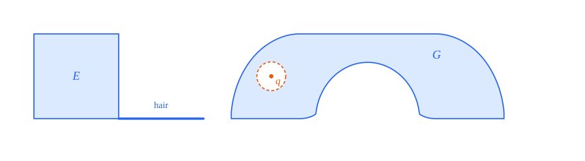

# 12. Uniqueness II: every maximum is Gerver's sofa

[Contents](README.md) · [← 11. Uniqueness I: approximating a maximizing cap](11-selection.md) · [13. The bridge to formal-conjectures →](13-bridge.md)

This chapter completes the proof that Gerver's sofa is the only moving sofa of maximum area, up to
a rotation and a translation (Theorem 12.1). [Chapter 11](11-selection.md) approximated a given
maximizing cap by penalized polygon maximizers whose defects $\sigma - \tau$ are small. Here those
defects give, for every maximizing right-angle cap, the curvature bounds and hence the injectivity
condition (Propositions 12.6 and 12.9, note 20's Proposition 3), and, for a maximizing monotone
sofa of smaller angle, a rotated copy with a right-angle motion (Proposition 12.13, note 20's
Proposition 4).

A right-angle cap in $\mathcal{K}^\mathrm{i}$ with the sofa area of Gerver's sofa attains the
maximum of Baek's upper bound $\mathcal{Q}$, and equality in each of Mamikon's terms forces its
support function to differ from that of Gerver's cap by $a\cos t$: the cap is a horizontal
translate of Gerver's (Proposition 12.19, note 20's Proposition 5). Finally, Gerver's sofa is the
closure of its interior (Proposition 12.22, note 20's Proposition 6), which recovers the given set
from its area (§12.6).

## Theorem 12.1 (uniqueness of Gerver's sofa)

Let $G$ be Gerver's sofa. For every moving sofa $S$ with $|S| = |G|$ there are an angle $\theta$ and
a vector $v$ such that

```math
R_\theta S + v = G .
```

So the moving sofas of maximum area are exactly the moving sofas that a rotation about the origin
followed by a translation maps onto $G$.

*Lean: [`Baek.gerver_sofa_unique`](../../Challenge.lean#L351), [`MovingSofaUniqueness.image_eq_gerver_of_volume_eq`](../../MovingSofaUniqueness/Main.lean#L233),
[`MovingSofaUniqueness.Rigid`](../../MovingSofaUniqueness/Rigid.lean).*

Here $|\cdot|$ is the Lebesgue measure, $G$ is defined from the solution of Romik's system in the
box of [Chapter 10](10-gerver.md), and a moving sofa is a closed connected set with a motion around
the corner of the hallway ([Chapter 2](02-preliminaries.md)). The equality is one of sets, not up to
a null set. The converse in the second sentence holds because rigid maps preserve area, and Baek's
Theorem 1.1.1 ([Chapter 9](09-optimality.md)) says that $|G|$ is the maximum. Not every rigid image
of $G$ is a moving sofa, since a moving sofa starts in the horizontal side of the hallway.

*Outline of the proof.* The proof follows the given sofa $S$, keeping a rigid image of it inside
each new set (Figure 12.1).

1. *Monotonization* ([Lemma 11.3](11-selection.md)). By Baek's Theorem 1.5.1, $S$ moves with a
   rotation angle $\omega \in [\sec^{-1}(2.2), \pi/2]$. A translate $S + v_0$ lies in
   its monotonization $T$, a monotone sofa of angle $\omega$ with $|T| = |G|$, whose cap maximizes
   $\mathcal{A}_\omega$.
2. *Right angle* (§12.3). If $\omega < \pi/2$, the pinned bounds of that cap give a right-angle
   motion of a rotated copy $R_a T$ (Proposition 12.13). Monotonizing $R_a T$ gives a monotone sofa
   $U$ of angle $\pi/2$ with $|U| = |G|$ that contains $R_a(S + v_0) + v_1$.
3. *Gerver's cap* (§12.1, §12.2, §12.4). The cap of $U$ maximizes $\mathcal{A}_{\pi/2}$, so it
   satisfies the injectivity condition (Corollary 12.10), and equality in Baek's upper bound makes
   $U$ a horizontal translate $G + (b, 0)$ (Proposition 12.19).
4. *Recovery* (§12.5, §12.6). So a rigid map $g$ maps $S$ into $G$. Since $S$ is closed, $G$ is the
   closure of its interior (Proposition 12.22) and $|g(S)| = |G|$, in fact $g(S) = G$
   (Lemma 12.23).


*Figure 12.1.* The containment chain of the proof. Every arrow is a translation or a rotation, and
every box contains the image of $S$ under the maps so far; all the sets have area $|G|$. Here
$g_1(p) = R_a(p + v_0) + v_1$ and $g(p) = g_1(p) - (b, 0)$.

## 12.1 The curvature bounds

In §12.1 and §12.2 the rotation angle is $\pi/2$. For a right-angle cap $K$ and $t \in [0, \pi/2]$,
the supporting hallway $L_K(t)$ has outer corner $\mathbf{y}_K(t) = h_K(t)u_t + h_K(t + \pi/2)v_t$
and inner corner $\mathbf{x}_K(t) = \mathbf{y}_K(t) - u_t - v_t$; its outer walls touch $K$ at the
vertices $A_K^\pm(t) = v_K^\pm(t)$ and $C_K^\pm(t) = v_K^\pm(t + \pi/2)$, and the *arm lengths* are

```math
f_K^\pm(t) = \bigl(\mathbf{y}_K(t) - A_K^\pm(t)\bigr) \cdot v_t , \qquad g_K^\pm(t) = \bigl(\mathbf{y}_K(t) - C_K^\pm(t)\bigr) \cdot u_t
```

(Baek's Definition 6.2.1; [Chapter 7](07-injectivity.md)). Baek's functions

```math
k_0(x) = \max\Bigl(|x - 1|, \frac{|x - 1| + 1}2\Bigr), \qquad m_0(x) = x - k_0(x)
```

(Definition 6.3.4) satisfy: $k_0$ is 1-Lipschitz, and $m_0$ is nondecreasing, with
$m_0(x) = \frac32 x - 1$ on $[0, 1]$, $\frac x2$ on $[1, 2]$ and $1$ on $[2, \infty)$.

Baek proves the injectivity condition for a balanced maximum cap $K$ from the bound
$\sigma_K \le k_0(g_K^+(t))\,\mathrm{d}t$ on $[0, \pi/2)$ (Theorem 6.4.3), the limit of the bounds
$\sigma_{K_n}(t) \le k_0(g_{K_n}^+(t))\delta + O(\delta^2)$ for maximum polygon caps with step size
$\delta$ (Theorem 6.3.3), whose proof uses the balance $\sigma = \tau$. For the polygon caps of
[Proposition 11.13](11-selection.md#proposition-1113-selection-note-20-proposition-1) the balance is
replaced by the floating defect bound $\sigma \le \tau + 2\eta\, w(t)$
([Proposition 11.16](11-selection.md#proposition-1116-floating-defects-note-20-proposition-2)),
whose errors add up to at most $2\eta$.

### Definition 12.2 (the curvature bounds)

A right-angle cap $K$ satisfies the *curvature bounds* if, as measures,

```math
\sigma_K \le k_0\bigl(g_K^+(t)\bigr)\,\mathrm{d}t \ \text{ on } [0, \pi/2), \qquad \sigma_K \le k_0\bigl(f_K^-(t - \pi/2)\bigr)\,\mathrm{d}t \ \text{ on } (\pi/2, \pi] . \tag{12.1}
```

These are the bounds (16) of note 20.

*Lean: [`FirstCurvatureBound`](../../MovingSofaUniqueness/Curvature.lean#L38), [`SecondCurvatureBound`](../../MovingSofaUniqueness/Curvature.lean#L44).*

Let $\Theta_n$, $n = 2^{k+1}$, be the right-angle set $\Theta^{(k)}$ of
[Chapter 11](11-selection.md), with step size $\delta = (\pi/2)/n$ (Baek's Definition 6.3.1). Its
normals are all floating, since $\Theta_n \subseteq (0, \pi/2)$.

### Lemma 12.3 (one normal of a polygon cap; note 20, (14) and (15))

Let $K$ be a polygon cap of $\Theta_n$ with step size $\delta$, let $t \in \Theta_n$, and put
$q = \tan(\delta/2)$. Then

```math
\tau_K(t) \le \max\Bigl(\tan\delta\,\bigl(g_K^-(t) - 1 + q\bigr),\ \tan\delta\,\bigl(1 - g_K^+(t) + q\bigr),\ 0\Bigr) + \max\bigl(2q - \sigma_K(t),\ 0\bigr) . \tag{12.2}
```

If moreover $\sigma_K(t) \le \tau_K(t) + e$ with $e \ge 0$, and $g_K^+(t) \le D$, then

```math
\sigma_K(t) \le k_0\bigl(g_K^+(t)\bigr)\,\delta + (D + 4)\,\delta^2 + e . \tag{12.3}
```

*Proof sketch.* (12.2) is the inner-ray geometry of the proof of Baek's Theorem 6.3.3
([Chapter 7](07-injectivity.md)). By Baek's Lemma 3.4.5, $\tau_K(t)$ is the length of the niche's
boundary on the half-line $\vec b_K(t)$ that leaves the inner corner $\mathbf{x}_K(t)$ along
$-v_t$. The part of this half-line beyond one of the inner walls $d_K(t \pm \delta)$ has the
length computed in Baek's Lemma 6.3.2, which gives the first term. The rest of the niche's boundary
on $b_K(t)$ lies beyond the three inner walls $b_K(t - \delta)$, $b_K(t)$, $b_K(t + \delta)$, in
the intersection of the half-planes $p \cdot u_s \ge h_K(s) - 1$, whose side on $b_K(t)$ has length
$\max(2q - \sigma_K(t), 0)$. For (12.3), let $M = |g_K^+(t) - 1| \le D + 1$. As
$g_K^-(t) \le g_K^+(t)$, the first maximum is at most $\tan\delta\,(M + q) \le \delta M + (D + 3)\delta^2$, using $\tan\delta \le \delta + \delta^2$ and $q \le \delta$ for $\delta \le \pi/4$.
If $\sigma_K(t) \ge 2q$, then $\sigma_K(t) \le \tau_K(t) + e \le \delta M + (D + 3)\delta^2 + e$. If
$\sigma_K(t) < 2q$, then $2\sigma_K(t) \le \delta M + (D + 3)\delta^2 + 2q + e$, which gives
$\sigma_K(t) \le \frac{M + 1}2\delta + (D + 4)\delta^2 + e$. Both $M$ and $\frac{M + 1}2$ are at
most $k_0(g_K^+(t))$. $\square$

*Lean: [`polygon_tau_le_geom`](../../MovingSofaUniqueness/Curvature.lean#L398), [`polygon_curvature_with_defect`](../../MovingSofaUniqueness/Curvature.lean#L500).*

### Lemma 12.4 (from normals to intervals)

Let $K$ be a polygon cap of $\Theta_n$ of diameter at most $D$, with $k_0(g_K^+) \le B$ on
$[0, \pi/2]$, and suppose that $\sigma_K(t) \le k_0(g_K^+(t))\,\delta + C\delta^2 + e(t)$ at every
grid normal $t \in \lbrace 0 \rbrace \cup \Theta_n$, with $C \ge 0$ and $e \ge 0$. Then for
$0 \le a \le b \le \pi/2$,

```math
\sigma_K\bigl([a, b)\bigr) \le \int_a^b k_0\bigl(g_K^+(u)\bigr)\,\mathrm{d}u + \Bigl(2B + \frac\pi2(C + D)\Bigr)\delta + \sum_{j=0}^{n-1} e(j\delta) ,
```

and the same bound holds for $\sigma_K((a, b))$ with $-\pi/2 \le a < b \le \pi/2$, integrating from
$\max(a, 0)$.

*Proof.* On each cell $[t, t + \delta]$ the vertices $A = A_K^+(t)$ and $C = C_K^+(t)$ do not
change, and $g_K^+(s) = (A - C) \cdot u_s$ there, with derivative $(A - C) \cdot v_s \in [-D, 0]$:
so $g_K^+$ is nonincreasing on the cell and drops by at most $D\delta$ (Baek's Lemma 6.4.1, where
$D = 5$). Since $k_0$ is 1-Lipschitz,
$k_0(g_K^+(t))\,\delta \le \int_t^{t + \delta} k_0(g_K^+) + D\delta^2$. The polygon $K$ has no edge
with normal in $(t, t + \delta)$, so $\sigma_K([t, t + \delta)) = \sigma_K(t)$. Summing over the at
most $n$ cells that meet $[a, b)$ costs $n(C + D)\delta^2 = \frac\pi2(C + D)\delta$, and the two
partial cells at the ends at most $2B\delta$. For open intervals that start below $0$, note that
$\sigma_K$ vanishes on $(-\pi/2, 0)$ for a right-angle cap. $\square$

*Lean: [`polygon_arm_cell`](../../MovingSofaUniqueness/Curvature.lean#L240), [`polygon_step_with_error`](../../MovingSofaUniqueness/Curvature.lean#L745), [`polygon_Ico_with_errors`](../../MovingSofaUniqueness/Curvature.lean#L763),
[`polygon_Ioo_with_errors`](../../MovingSofaUniqueness/Curvature.lean#L923), [`polygonGridError`](../../MovingSofaUniqueness/Curvature.lean#L758).*

### Lemma 12.5 (passing to the limit)

Let polygon caps $K_n$ converge in the Hausdorff distance to a right-angle cap $K$, and suppose that

```math
\sigma_{K_n}\bigl((a, b)\bigr) \le \int_{\max(a, 0)}^b k_0\bigl(g_{K_n}^+(u)\bigr)\,\mathrm{d}u + \varepsilon_n
```

whenever $-\pi/2 \le a < b \le \pi/2$ and $\max(a, 0) \le b$, with $\varepsilon_n \to 0$. Then $K$
satisfies the first curvature bound.

*Proof.* The integrals converge, $\int_{\max(a,0)}^b k_0(g_{K_n}^+) \to \int_{\max(a,0)}^b k_0(g_K^+)$, because $g_{K_n}^+ \to g_K^+$ in $L^1$ (Baek's Lemma 6.4.2) and $k_0$ is 1-Lipschitz.
The mass of an open interval is
$\sigma_K((a, b)) = v_K^-(b) \cdot v_b - v_K^+(a) \cdot v_a + \int_a^b h_K$; replacing the two
vertices by the intersections of the supporting lines at $b - \varepsilon, b$ and at
$a, a + \varepsilon$ gives lower bounds for every convex body, which converge with $K_n$ for fixed
$\varepsilon$, and tend to $\sigma_K((a, b))$ as $\varepsilon \to 0$. So
$\sigma_K((a, b)) \le \int_{\max(a, 0)}^b k_0(g_K^+)$. Bounds on these open intervals, including
those that start below $0$, determine the inequality of measures on $[0, \pi/2)$, including the
normal $0$. $\square$

*Lean: [`k0_integral_tendsto`](../../MovingSofaUniqueness/Curvature.lean#L987), [`curvature_Ioo_limit`](../../MovingSofaUniqueness/Curvature.lean#L1033), [`firstCurvature_of_Ioo`](../../MovingSofaUniqueness/Curvature.lean#L1077),
[`firstCurvature_of_polygon_errors`](../../MovingSofaUniqueness/Curvature.lean#L1168), [`lemma6_4_2`](../../MovingSofaOptimality/Injectivity/LimitIneq.lean#L312).*

Because the intervals may start below $0$, the bound covers an atom at the normal $0$: note 20
stresses that (16) proves the absence of such an atom rather than assuming it.

### Proposition 12.6 (curvature bounds; note 20, Proposition 3)

Every right-angle cap $K$ that maximizes $\mathcal{A}_{\pi/2}$ with $\mathcal{A}_{\pi/2}(K) > 0$
satisfies the curvature bounds (12.1).

*Proof.* Take the selection of Proposition 11.13 for $\omega = \pi/2$: penalized maximizers $K_n$ of
$\Theta_{2^{k_n + 1}}$, with step sizes $\delta_n \to 0$, in a box $[-R, R] \times [0, 1]$,
converging to $K$. Put $\eta_n = d_\mathrm{H}(K_n, K) \to 0$; the sampled supports of $K_n$ are
within $\eta_n$ of those of $K$. The box bounds the diameter by $D = 2R + 2$, so $g_{K_n}^+ \le D$ and
$k_0(g_{K_n}^+) \le D + 1$. At every $t \in \Theta_{2^{k_n+1}}$,
Proposition 11.16 gives $\sigma_{K_n}(t) \le \tau_{K_n}(t) + 2\eta_n w_n(t)$, where $w_n(t)$ is the
sample weight at $t$, so Lemma 12.3 gives (12.3) with $e(t) = 2\eta_n w_n(t)$; at $t = 0$ the bound
is trivial, as $\sigma_{K_n}(0) = 0$. The weights at the distinct grid normals add up to at most the
total weight, which is at most one ([Lemma 11.7](11-selection.md#lemma-117-the-dyadic-penalty)), so
the errors add up to at most $2\eta_n$. By Lemma 12.4 the hypothesis of Lemma 12.5 holds with
$\varepsilon_n = A\delta_n + 2\eta_n \to 0$, $A = 2(D + 1) + \frac\pi2(2D + 4)$, which gives the first
bound.

For the second bound, the reflection $(x, y) \mapsto (-x, y)$ maps $K$ to a right-angle cap $K^m$
with the same sofa area (Baek's Proposition 2.5.4), which is therefore maximizing; it maps
$\sigma_{K^m}$ to $\sigma_K$ under $t \mapsto \pi - t$, and exchanges the arms,
$g_{K^m}^+(t) = f_K^-(\pi/2 - t)$ (Baek's Proposition 6.2.2, with the reflected angle of
REPORT.md, E13). So the first bound for $K^m$ is the second bound for $K$. $\square$

*Lean: [`curvature_of_maximal_positive`](../../MovingSofaUniqueness/Curvature.lean#L1470), [`firstCurvature_of_maximal_positive`](../../MovingSofaUniqueness/Curvature.lean#L1286),
[`sampled_grid_error_le`](../../MovingSofaUniqueness/Curvature.lean#L1237), [`diameter_le_box`](../../MovingSofaUniqueness/Curvature.lean#L1252), [`secondCurvature_of_mirror_first`](../../MovingSofaUniqueness/Curvature.lean#L1420),
[`sigma_eq_map_mirror`](../../MovingSofaUniqueness/Curvature.lean#L1411).*

Gerver's cap maximizes $\mathcal{A}_{\pi/2}$, so it satisfies the curvature bounds. Figure 12.2
shows the first of them, computed from Romik's rotation path: it is an equality on most of
$[0, \pi/2)$.


*Figure 12.2.* The first curvature bound for Gerver's cap $\mathcal{C}(G)$, which maximizes
$\mathcal{A}_{\pi/2}$ by Baek's theorem ([Lemma 11.2](11-selection.md#lemma-112-the-maximum-value)):
the density $r(t) = A'(t) \cdot v_t$ of $\sigma_{\mathcal{C}(G)}$ on $[0, \pi/2)$ (blue) lies below
$k_0(g(t))$ (orange, dashed), computed from Romik's rotation path. Here
$t_1, \dots, t_4$ are $\varphi, \theta, \pi/2 - \theta, \pi/2 - \varphi$. The two agree from $t_1$
until $g(t) = 2$, near $t = 0.62$, and from $t_3$ to $t_4$; the gap is shaded.

## 12.2 The injectivity condition

Recall Baek's injectivity condition (Definition 6.1.2) for a right-angle cap $K$: (1) $\sigma_K$ has
a density on $[0, \pi/2)$ and on $(\pi/2, \pi]$; (2) the inner corner $\mathbf{x}_K$ is continuously
differentiable on $[0, \pi/2]$; (3) $\mathbf{x}_K'(t) \cdot u_t < 0 < \mathbf{x}_K'(t) \cdot v_t$
for $t \in (0, \pi/2)$. The space $\mathcal{K}^\mathrm{i}$ consists of the right-angle caps with the
injectivity condition and area at least $2.2$. Under (1), $f_K^+ = f_K^-$ on $[0, \pi/2)$ and
$g_K^+ = g_K^-$ on $(0, \pi/2]$; write $f_K = f_K^-$ and $g_K = g_K^+$, which are continuous on
$[0, \pi/2]$ (Baek's Definition 6.4.1, Propositions 6.4.5 and 6.4.6).

### Lemma 12.7 (the integral inequalities; note 20, (17))

Let $K$ be a right-angle cap with the curvature bounds. Then $K$ satisfies condition (1), and

```math
\int_0^t m_0\bigl(g_K(u)\bigr)\,\mathrm{d}u \le f_K(t) - 1 \quad \bigl(t \in [0, \pi/2)\bigr), \qquad \int_t^{\pi/2} m_0\bigl(f_K(u)\bigr)\,\mathrm{d}u \le g_K(t) - 1 \quad \bigl(t \in (0, \pi/2]\bigr) .
```

*Proof.* Condition (1) holds by the Radon–Nikodym theorem, since each restriction of $\sigma_K$ is
dominated by a measure with a density. Baek's Theorem 6.2.5, in integrated form, gives
$f_K^+(t) - f_K^+(0) = \int_0^t g_K^+ - \sigma_K((0, t])$. Here $f_K^+ = f_K$ on $[0, \pi/2)$,
$f_K(0) = 1$ since the vertex $A_K(0)$ lies on the floor (REPORT.md, E17), and
$\sigma_K((0, t]) \le \int_0^t k_0(g_K)$ by the first curvature bound; as $m_0 = x - k_0$, this is
the first inequality. The second is the same argument for $g$, with
$g_K^+(\pi/2) - g_K^+(t) = \sigma_K((t + \pi/2, \pi]) - \int_t^{\pi/2} f_K^+$, the value
$g_K(\pi/2) = 1$ and the second curvature bound. $\square$

*Lean: [`injCond1_of_curvature`](../../MovingSofaUniqueness/Curvature.lean#L51), [`first_arm_integral_lower`](../../MovingSofaUniqueness/Curvature.lean#L144), [`second_arm_integral_lower`](../../MovingSofaUniqueness/Curvature.lean#L166),
[`gPlus_sub_gPlus`](../../MovingSofaUniqueness/Curvature.lean#L108).*

### Lemma 12.8 (the lower sequence; Baek, Lemmas 6.5.2 and 6.5.5)

Let $\mathcal{F}f(x) = 1 + \int_0^x m_0(f(\pi/2 - u))\,\mathrm{d}u$, $f_0 = 0$ and
$f_{n+1} = \max(f_n, \mathcal{F}f_n)$ (Baek's Definitions 6.5.1 and 6.5.2).

1. If continuous functions $f, g \ge 0$ on $[0, \pi/2]$ satisfy the two inequalities of
   Lemma 12.7, then $f_n(t) \le f(t)$ for $t \in [0, \pi/2)$ and $f_n(\pi/2 - t) \le g(t)$ for
   $t \in (0, \pi/2]$, for every $n$.
2. $f_{11}(x) > 1$ for every $x \in (0, \pi/2]$ (Figure 12.3).

*Proof.* (1) Induction on $n$; $f_0 = 0 \le f, g$. If the claim holds for $n$, then for
$t \in [0, \pi/2)$, since $m_0$ is nondecreasing,
$\int_0^t m_0(f_n(\pi/2 - u))\,\mathrm{d}u \le \int_0^t m_0(g(u))\,\mathrm{d}u \le f(t) - 1$, so
$\mathcal{F}f_n(t) \le f(t)$; the bound for $g$ is symmetric. (2) is Baek's Lemma 6.5.5: with
$j_c(x) = \max(1 - x, c)$, a direct computation gives $\mathcal{F}j_c \ge j_{c + 1/12}$ for
$c \in [0, 2/3]$ (Lemma 6.5.3), hence $f_m \ge j_{(m-1)/12}$ for $1 \le m \le 10$; then
$f_{10} \ge 3/4 > 2/3$, where $m_0$ is positive, and
$f_{11}(x) \ge \mathcal{F}f_{10}(x) > 1$ for $x > 0$. Baek states Lemmas 6.5.3 and 6.5.5 on $[0, 1]$
and $(0, 1]$; the proofs and their use need $[0, \pi/2]$ and $(0, \pi/2]$ (REPORT.md, E17). $\square$

*Lean: [`lowerSeq_le_of_integral_bounds`](../../MovingSofaUniqueness/Curvature.lean#L636), [`lowerSeq`](../../MovingSofaOptimality/Injectivity/BoundingArms.lean#L202), [`lowerOp`](../../MovingSofaOptimality/Injectivity/BoundingArms.lean#L199), [`lemma6_5_5`](../../MovingSofaOptimality/Injectivity/BoundingArms.lean#L364).*


*Figure 12.3.* Baek's lower sequence $f_1, \dots, f_{11}$ (grey, darker for larger $n$), computed
numerically, with $f_{11}$ in orange above the line at height one, and the arm $f$ of Gerver's cap
(blue, dashed), which lies above all of them, as Lemma 12.8 (1) predicts for a maximizing cap.

### Proposition 12.9 (injectivity; note 20, Proposition 3)

A right-angle cap $K$ with the curvature bounds satisfies the injectivity condition. Moreover
$f_K(t) > 1$ and $g_K(t) > 1$ for $t \in (0, \pi/2)$.

*Proof.* By Lemma 12.7, $K$ satisfies condition (1) and the integral inequalities, and $f_K, g_K$ are
continuous and nonnegative on $[0, \pi/2]$. By Lemma 12.8, for $t \in (0, \pi/2)$,
$1 < f_{11}(t) \le f_K(t)$ and $1 < f_{11}(\pi/2 - t) \le g_K(t)$. Under condition (1) the inner
corner is continuously differentiable with

```math
\mathbf{x}_K'(t) = -\bigl(f_K(t) - 1\bigr)u_t + \bigl(g_K(t) - 1\bigr)v_t
```

(Baek's Proposition 6.4.6), which is condition (2), and the strict inequalities give condition (3).
$\square$

*Lean: [`injectivity_of_curvature`](../../MovingSofaUniqueness/Curvature.lean#L708), [`arms_strict_of_curvature`](../../MovingSofaUniqueness/Curvature.lean#L691), [`proposition6_4_6_deriv`](../../MovingSofaOptimality/Injectivity/LimitIneq.lean#L1070).*

*Remark (the formal route).* From (17), note 20 shows $f, g \ge 1$ by a maximum-deficit argument,
with $m_0(x) \ge \frac12 - \frac32(1 - x)_+$, and then $f(t) \ge 1 + t/2$ and
$g(t) \ge 1 + (\pi/2 - t)/2$. The formalization compares the arms with Baek's lower sequence
instead, as the library does for balanced maximum caps; this gives the strict inequalities that
condition (3) needs.

### Corollary 12.10 (maximizing right-angle caps; note 20, Proposition 3)

Every right-angle cap $K$ with $\mathcal{A}_{\pi/2}(K) = |G|$ lies in $\mathcal{K}^\mathrm{i}$.

*Proof.* By Lemma 11.2, $K$ maximizes $\mathcal{A}_{\pi/2}$, and
$\mathcal{A}_{\pi/2}(K) = |G| \ge 2.2 > 0$. Propositions 12.6 and 12.9 give the injectivity
condition, and $|K| \ge |K| - |\mathcal{N}(K)| = |G| \ge 2.2$. $\square$

*Lean: [`MovingSofaUniqueness.isKi_of_maximal_area`](../../MovingSofaUniqueness/Main.lean#L88), [`MovingSofaUniqueness.sofaArea_pos_of_isMaxCap`](../../MovingSofaUniqueness/Main.lean#L78),
[`IsKi`](../../MovingSofaOptimality/Optimality/Domain.lean#L281).*

## 12.3 The right-angle motion

Baek's Theorem 1.5.2 rotates a balanced maximum sofa of angle $\omega < \pi/2$ into one with a
right-angle motion. Its proof uses the balance only through the pinned bounds of Theorem 4.1.4,
which [Proposition 11.23](11-selection.md#proposition-1123-pinned-bounds-note-20-proposition-4)
provides for every maximizing cap. Let $c_\omega = \sec\omega - \tan\omega$, the abscissa of the
corner $o_\omega = (c_\omega, 1)$, so that $o_\omega - v_0 = c_\omega u_0$ and
$o_\omega - u_\omega = c_\omega v_\omega$ (Baek's Proposition 4.2.1).

### Lemma 12.11 (the triangle in the niche; Baek, Theorem 4.2.5)

Let $\omega \in [\sec^{-1}(2.2), \pi/2)$, and let $K$ be a cap of angle $\omega$ with
$\mathcal{A}_\omega(K) \ge 11/5$ and the pinned bounds $w_K^\circ \le \sigma_K(\pi/2)$ and
$z_K^\circ \le \sigma_K(\omega)$. Then for some $t \in (0, \omega)$ the points $O$,
$c_\omega u_0$ and $c_\omega v_\omega$ lie in the closure of the inner quadrant $Q_K^-(t)$.

*Proof sketch.* This is Baek's proof of Theorem 4.2.5 ([Chapter 5](05-rotation-angle.md)), with
the pinned bounds as hypotheses in place of Theorem 4.1.4. Let $d = 5/4$ if
$\omega < \arctan(11/5)$ and $d = 11/10$ otherwise (Baek's Definition 4.2.2). If $h_K(0)$ and
$h_K(\omega + \pi/2)$ were both less than $d + c_\omega$, the cap would lie in the region
$P_\omega \cap H_-(0, d + c_\omega) \cap H_-(\omega + \pi/2, d + c_\omega)$, of area less than
$11/5$ (Lemma 4.2.2), although $|K| \ge \mathcal{A}_\omega(K) \ge 11/5$. The reflection $M_\omega$
exchanges the two pinned bounds, so assume $h_K(0) \ge d + c_\omega$, and put
$d' = h_K(0) - c_\omega$. The supporting lines at $0$ and $\omega$ meet at
$r = (d' + c_\omega, 1 - d'\cot\omega)$, and with $g = (1 - (1 - d'\cot\omega)^2)^{1/2}$ the point
$A_K^-(0) - g u_0$ lies outside every open half-plane $\lbrace p \cdot u_s < h_K(s) - 1 \rbrace$,
$s \in (0, \omega)$, so $g \le w_K^\circ \le \sigma_K(\pi/2)$: this is where the pinned bound is
used. So the top edge of $K$ has length at least $g$, and $q_1 = o_\omega - g u_0$ lies in $K$, as
does $q_0 = A_K^-(0) = (d' + c_\omega, 0)$. For $t = \pi/2 - \omega$, the inner quadrant of
$\lbrace q_0, q_1 \rbrace$, which lies in $Q_K^-(t)$, contains the three points, by the
inequalities $d'\sin\omega > 1$ and $g > 2\cos\omega$ of Baek's Lemma 4.2.4. That lemma is
stated for $\omega \ge \arctan(11/5)$, and its proof covers
$[\sec^{-1}(2.2), \pi/2)$ (REPORT.md, E9). $\square$

*Lean: [`consumed_of_pinned`](../../MovingSofaUniqueness/AngleExtension.lean#L26), [`lemma4_2_2`](../../MovingSofaOptimality/Angle/RightAngle.lean#L304), [`lemma4_2_4`](../../MovingSofaOptimality/Angle/RightAngle.lean#L517), [`theorem4_2_5`](../../MovingSofaOptimality/Angle/RightAngle.lean#L791).*

### Lemma 12.12 (rotating inside the horizontal side; Baek, Theorem 1.5.2)

Let $S$ be a moving sofa with rotation angle $\omega < \pi/2$ such that
$(p - q) \cdot u_t \le 1$ for all $p, q \in S$ and $t \in [\omega, \pi/2]$. Then
$R_\beta S$, $\beta = \pi/2 - \omega$, moves with rotation angle $\pi/2$.

*Proof.* The height of $R_\varphi S$, its width in the direction $u_{\pi/2}$, is the width of $S$ in
the direction $u_{\pi/2 - \varphi}$, which is at most one for $\varphi \in [0, \beta]$. The motion of
$R_\beta S$ has three phases. First it turns back by $\beta$ to the orientation of $S$; at each
intermediate angle $\varphi$, $R_\varphi S$ is placed far to the left, at the height given by its
support function, inside the horizontal side $H_L$. Then it translates inside $H_L$ to the starting
position of the original motion of $S$, and finally it follows that motion. Relative to the
starting copy, the total rotation is $\beta + \omega = \pi/2$. $\square$

*Lean: [`right_angle_motion_of_width`](../../MovingSofaUniqueness/AngleExtension.lean#L83).*

### Proposition 12.13 (right-angle motion; note 20, Proposition 4)

Let $S$ be a monotone sofa of angle $\omega \in [\sec^{-1}(2.2), \pi/2]$ with
$|S| = |G|$. Then $R_a S$ moves with rotation angle $\pi/2$ for some angle $a$.

*Proof.* If $\omega = \pi/2$, take $a = 0$. Otherwise the cap $K = \mathcal{C}(S)$ maximizes
$\mathcal{A}_\omega$, with $\mathcal{A}_\omega(K) = |S| = |G| \ge 11/5$ (Lemma 11.3), so
Proposition 11.23 gives the pinned bounds and Lemma 12.11 a quadrant $Q_K^-(t_0)$, $t_0 \in (0, \omega)$, whose closure contains the triangle $\Delta = \operatorname{conv}\lbrace O, c_\omega u_0, c_\omega v_\omega \rbrace$. The interior of $\Delta$ lies in $F_\omega \cap Q_K^-(t_0)$, hence in the
niche, and $S = K \setminus \mathcal{N}(K)$ (Baek's Theorem 2.4.3). So $S$ lies in the pentagon
$P_\omega \setminus \operatorname{int} \Delta$, whose width in the direction $u_t$ is
$\max(\sin t, \cos(t - \omega)) \le 1$ for $t \in [\omega, \pi/2]$ (REPORT.md, E10; Figure 12.4).
Lemma 12.12 applies with $a = \beta$. $\square$

*Lean: [`MovingSofaUniqueness.maximal_monotone_has_right_angle`](../../MovingSofaUniqueness/Main.lean#L164),
[`right_angle_motion_of_pinned_bounds`](../../MovingSofaUniqueness/AngleExtension.lean#L185).*


*Figure 12.4.* The extra rotation of Proposition 12.13, for $\omega = 1.1$. Top: the triangle
$\Delta$ (orange) at the corner $O$ of $P_\omega$, which lies in the closure of the niche, and the
pentagon $P_\omega \setminus \Delta$ (blue). Below: the pentagon rotated by $\varphi = \beta$,
$\beta/2$ and $0$, $\beta = \pi/2 - \omega$; for every $\varphi \in [0, \beta]$ it fits in a strip
of width one, so a sofa inside it can turn by $\beta$ in the horizontal side of the hallway before
it starts its own motion.

## 12.4 Equality in the upper bound

Recall Baek's upper bound ([Chapters 8](08-convex-curves.md) and [9](09-optimality.md)). Let
$\varphi$ be Gerver's angle. For $K \in \mathcal{K}^\mathrm{i}$, the canonical triple
$x_K = (K, B_K, D_K)$ lies in the convex domain $\mathcal{L}$ (Theorem 8.1.8), and
$\mathcal{A}_{\pi/2}(K) \le \mathcal{Q}(x_K)$ (Theorem 8.2.4). The functional $\mathcal{Q}$ is
quadratic and concave on $\mathcal{L}$ (Proposition 8.2.1, Theorem 8.3.8) and attains its maximum at
Gerver's triple $x_G$ (Corollary 8.5.8), where $\mathcal{Q}(x_G) = \mathcal{A}_{\pi/2}(\mathcal{C}(G)) = |G|$ (Theorem 8.4.6). On $\mathcal{L}$, $\mathcal{Q} = \mathcal{P}_K - \mathcal{R}_B - \mathcal{L}_D$ (Lemma 8.3.4), where $\mathcal{P}_K + \mathcal{S}_K$ is linear on $\mathcal{K}^\mathrm{i}$
(Lemma 8.3.7) and $\mathcal{S}_K$, $\mathcal{R}_B$, $\mathcal{L}_D$ are convex (Lemma 8.3.3). The
term $\mathcal{S}_K$ is a sum of four Mamikon areas,

```math
\mathcal{S}_K = \mathcal{M}_K(0, \varphi; \mathbf{l}^{\pi/2}) + \mathcal{M}_K(\varphi, \pi/2 - \varphi; \mathbf{y}) + \mathcal{M}_K(\pi/2 - \varphi, \pi/2; \mathbf{l}^{\pi - \varphi}) + \mathcal{M}_K(\pi/2, \pi; \mathbf{l}^{\pi})
```

(Definition 8.3.2), where $\mathbf{l}^T(t) = l_K(t) \cap l_K(T)$ follows the supporting line at $t$
to its intersection with that at the *target* $T$, and $\mathbf{y} = \mathbf{y}_K$ is the outer
corner. By Mamikon's theorem (Baek's Theorem 7.4.1), for $a < b < a + \pi$ and a continuous curve
$\mathbf{z}$ of bounded variation with $\mathbf{z}(t) \in l_K(t)$,

```math
\mathcal{M}_K(a, b; \mathbf{z}) = \frac12 \int_a^b \alpha(t)^2\,\mathrm{d}t , \qquad \alpha(t) = \bigl(\mathbf{z}(t) - v_K^+(t)\bigr) \cdot v_t ,
```

where $\alpha$ is the *tangent displacement*.

### Lemma 12.14 (equality in Baek's upper bound)

Let $K \in \mathcal{K}^\mathrm{i}$ with $\mathcal{A}_{\pi/2}(K) = |G|$. Then
$\mathcal{Q}(x_K) = \mathcal{Q}(x_G)$, and for every $c \in [0, 1]$ the combination
$(1 - c)x_G + c\,x_K$ attains equality in each of the three convexity inequalities, of
$\mathcal{S}$, $\mathcal{R}$ and $\mathcal{L}$.

*Proof.* $|G| = \mathcal{A}_{\pi/2}(K) \le \mathcal{Q}(x_K) \le \mathcal{Q}(x_G) = |G|$. A concave
functional is constant on the segment between two maximizers, so
$\mathcal{Q}((1 - c)x_G + c\,x_K) = (1 - c)\mathcal{Q}(x_G) + c\,\mathcal{Q}(x_K)$. As
$\mathcal{Q} = (\mathcal{P} + \mathcal{S}) - \mathcal{S} - \mathcal{R} - \mathcal{L}$ with the first
term linear and the other three convex, equality in the concavity of $\mathcal{Q}$ forces equality
in each of the three. $\square$

*Lean: [`ki_maximizer_equality_conditions`](../../MovingSofaUniqueness/Rigidity.lean#L881), [`ki_upperQL_eq_gerver_of_sofaArea_eq`](../../MovingSofaUniqueness/Rigidity.lean#L866),
[`MovingSofaOptimality.ConvexDomain.eq_on_segment_of_isMax`](../../MovingSofaUniqueness/Rigidity.lean#L281), [`mamikonSegmentEquality_iff`](../../MovingSofaUniqueness/Rigidity.lean#L760),
[`MamikonSegmentEquality`](../../MovingSofaUniqueness/Rigidity.lean#L750), [`kiExtensionTriple`](../../MovingSofaUniqueness/Rigidity.lean#L859).*

### Lemma 12.15 (equality in one Mamikon term)

Let $K_0, K_1$ be right-angle caps with condition (1), let $[a, b]$ lie in $[0, \pi/2]$ or in
$[\pi/2, \pi]$, let $c \in (0, 1)$, $K_c = (1 - c)K_0 + cK_1$, and $f = h_{K_1} - h_{K_0}$.

1. If $a < b \le T < a + \pi$ and
   $\mathcal{M}_{K_c}(a, b; \mathbf{l}^T) = (1 - c)\mathcal{M}_{K_0}(a, b; \mathbf{l}^T) + c\,\mathcal{M}_{K_1}(a, b; \mathbf{l}^T)$, then $f(t) = p\cos t + q\sin t$ on $[a, b]$ and at
   $t = T$, for some $p, q$.
2. If the same equality holds for the outer corner $\mathbf{y}$, then
   $f(t) = f(b) - \int_t^b f(u + \pi/2)\,\mathrm{d}u$ on $[a, b]$.

*Proof.* Both curves are affine under Minkowski combinations (Baek's Theorem 8.3.2 for
$\mathbf{l}^T$; the outer corner is linear in the support function), so the displacements are too, $\alpha_c = (1 - c)\alpha_0 + c\,\alpha_1$, and by Mamikon's theorem the
convexity gap is

```math
(1 - c)\,\mathcal{M}_{K_0} + c\,\mathcal{M}_{K_1} - \mathcal{M}_{K_c} = \frac{c(1 - c)}2 \int_a^b (\alpha_0 - \alpha_1)^2 ,
```

which is $\frac18 \int (\alpha_0 - \alpha_1)^2$ at $c = \frac12$. Equality makes
$\alpha_0 = \alpha_1$ almost everywhere, hence everywhere on $(a, b)$, where both are continuous
under condition (1). Under condition (1), $h_K$ is differentiable on $(a, b)$ with
$h_K'(t) = v_K^+(t) \cdot v_t$. For part 1, take $\mathbf{z} = \mathbf{l}^T$:
$\alpha(t) = \frac{h(T) - h(t)\cos(T - t)}{\sin(T - t)} - h'(t)$, so $\alpha_0 = \alpha_1$ is the
*tangent equation* $\sin(T - t)f'(t) + \cos(T - t)f(t) = f(T)$. The quotient
$(f(t) - f(T)\cos(T - t))/\sin(T - t)$ then has derivative zero, so
$f(t) = f(T)\cos(T - t) + C\sin(T - t)$ on $(a, b)$, and by continuity on $[a, b]$. For part 2,
take $\mathbf{z} = \mathbf{y}$: $\alpha(t) = h(t + \pi/2) - h'(t)$, so $f'(t) = f(t + \pi/2)$, which
integrates to the stated form. $\square$

*Lean: [`halfSquareIntegral_combo_gap`](../../MovingSofaUniqueness/Rigidity.lean#L95), [`halfSquareIntegral_combo_eq_iff`](../../MovingSofaUniqueness/Rigidity.lean#L124),
[`displacement_eqOn_of_mamikon_eq`](../../MovingSofaUniqueness/Rigidity.lean#L434), [`tangentKernel_of_mamikon_eq`](../../MovingSofaUniqueness/Rigidity.lean#L630), [`middleKernel_of_mamikon_eq`](../../MovingSofaUniqueness/Rigidity.lean#L682),
[`tangentKernel_of_equation`](../../MovingSofaUniqueness/Rigidity.lean#L541), [`integrated_middle_equation`](../../MovingSofaUniqueness/Rigidity.lean#L597).*

### Definition 12.16 (cap kernel)

Let $\varphi \in (0, \pi/4)$. A function $f$ is a *cap kernel* if $f(\pi/2) = 0$, if on each of
$[0, \varphi]$, $[\pi/2 - \varphi, \pi/2]$ and $[\pi/2, \pi]$ it has the form $p\cos t + q\sin t$,
with the same constants also at the targets $\pi/2$, $\pi - \varphi$ and $\pi$ respectively, and if

```math
f(t) = f(\pi/2 - \varphi) - \int_t^{\pi/2 - \varphi} f(u + \pi/2)\,\mathrm{d}u \qquad \text{for } t \in [\varphi, \pi/2 - \varphi] .
```

*Lean: [`CapKernel`](../../MovingSofaUniqueness/Rigidity.lean#L175), [`TangentKernel`](../../MovingSofaUniqueness/Rigidity.lean#L169).*

### Lemma 12.17 (the cap kernel is a horizontal translation)

1. If $K_0, K_1 \in \mathcal{K}^\mathrm{i}$ and the convexity inequality of $\mathcal{S}$ is an
   equality at some $c \in (0, 1)$, then $h_{K_1} - h_{K_0}$ is a cap kernel.
2. Every cap kernel satisfies $f(t) = a\cos t$ on $[0, \pi]$, with $a = -f(\pi)$.

*Proof.* (1) Each of the four Mamikon areas of $\mathcal{S}$ is convex, so equality for their sum
forces equality for each, and Lemma 12.15 turns the four equalities into the four parts of
Definition 12.16; $f(\pi/2) = 0$ since both caps have support $1$ at $\pi/2$.

(2) Solve in reverse order, as in note 20. On $[\pi/2, \pi]$, $f = p\cos t + q\sin t$ with
$f(\pi/2) = q = 0$, and the value at $\pi$ gives $p = a$. On $[\pi/2 - \varphi, \pi/2]$,
$f = p'\cos t + q'\sin t$ with $q' = 0$ from $f(\pi/2) = 0$, and at the target $\pi - \varphi \in [\pi/2, \pi]$, $p'\cos(\pi - \varphi) = a\cos(\pi - \varphi)$, so $p' = a$. On
$[\varphi, \pi/2 - \varphi]$, the integrand is $f(u + \pi/2) = a\cos(u + \pi/2) = -a\sin u$, so

```math
f(t) = a\cos(\pi/2 - \varphi) + a\int_t^{\pi/2 - \varphi} \sin u\,\mathrm{d}u = a\cos t .
```

On $[0, \varphi]$, $f = p''\cos t + q''\sin t$ with $q'' = f(\pi/2) = 0$ at the target, and the
value at $\varphi$ gives $p'' = a$. $\square$

*Lean: [`capKernel_of_mamikonS_eq`](../../MovingSofaUniqueness/Rigidity.lean#L915), [`capKernel_of_triple_midpoint`](../../MovingSofaUniqueness/Rigidity.lean#L974),
[`CapKernel.eq_horizontal_translation`](../../MovingSofaUniqueness/Rigidity.lean#L197), [`CapKernel.upper_left`](../../MovingSofaUniqueness/Rigidity.lean#L184).*

### Lemma 12.18 (caps with translated supports; note 20, (21))

Let $K$ and $C$ be right-angle caps with $h_K(t) - h_C(t) = a\cos t$ for $t \in [0, \pi]$. Then

```math
K \setminus \mathcal{N}(K) = \bigl(C \setminus \mathcal{N}(C)\bigr) + (a, 0) .
```

*Proof.* A right-angle cap is the set of points $p$ with $p_y \ge 0$ and $p \cdot u_t \le h(t)$ for
$t \in [0, \pi]$, and its niche is the set of points with $p_y \ge 0$ in some inner quadrant
$\lbrace p \cdot u_t < h(t) - 1,\ p \cdot v_t < h(t + \pi/2) - 1 \rbrace$, $t \in (0, \pi/2)$.
Since $(p - (a, 0)) \cdot u_t = p \cdot u_t - a\cos t$ and
$(p - (a, 0)) \cdot v_t = p \cdot v_t - a\cos(t + \pi/2)$, both descriptions for $K$ at $p$ are those
for $C$ at $p - (a, 0)$. $\square$

*Lean: [`sofa_eq_translate_of_upper_support`](../../MovingSofaUniqueness/Rigidity.lean#L1098), [`mem_right_cap_iff`](../../MovingSofaUniqueness/Rigidity.lean#L1008), [`mem_right_niche_iff`](../../MovingSofaUniqueness/Rigidity.lean#L1030),
[`mem_cap_sub_horizontal_iff`](../../MovingSofaUniqueness/Rigidity.lean#L1051), [`mem_niche_sub_horizontal_iff`](../../MovingSofaUniqueness/Rigidity.lean#L1070).*

Note 20 obtains the lower supports from the bottom segment of the cap; the formal proof describes
the cap by its upper supports and the floor, which amounts to the same.

### Proposition 12.19 (Gerver's cap up to translation; note 20, Proposition 5)

Let $K \in \mathcal{K}^\mathrm{i}$ with $\mathcal{A}_{\pi/2}(K) = |G|$. Then
$K \setminus \mathcal{N}(K) = G + (a, 0)$ for some $a \in \mathbb{R}$.

*Proof.* Gerver's cap $\mathcal{C}(G)$ lies in $\mathcal{K}^\mathrm{i}$ (Baek's Theorem 6.1.2, proved
here from Romik's equations; REPORT.md, E12). Lemma 12.14 at $c = \frac12$ gives equality in the
convexity inequality of $\mathcal{S}$ between $\mathcal{C}(G)$ and $K$, so by Lemma 12.17
$h_K(t) - h_{\mathcal{C}(G)}(t) = a\cos t$ on $[0, \pi]$, with
$a = h_{\mathcal{C}(G)}(\pi) - h_K(\pi)$. By Lemma 12.18,
$K \setminus \mathcal{N}(K) = (\mathcal{C}(G) \setminus \mathcal{N}(\mathcal{C}(G))) + (a, 0)$, and
$G = \mathcal{C}(G) \setminus \mathcal{N}(\mathcal{C}(G))$ by Baek's Theorem 2.4.3, $G$ being a
monotone sofa (Figure 12.5). $\square$

*Lean: [`MovingSofaUniqueness.ki_sofa_eq_gerver_translate`](../../MovingSofaUniqueness/Main.lean#L103), [`capKernel_of_triple_midpoint`](../../MovingSofaUniqueness/Rigidity.lean#L974),
[`theorem6_1_2`](../../MovingSofaOptimality/Gerver/Properties.lean#L140), [`theorem2_4_3`](../../MovingSofaOptimality/Monotone/CapNiche.lean#L216).*


*Figure 12.5.* Proposition 12.19. Top: Gerver's cap $\mathcal{C}(G)$ and its translate by $(a, 0)$;
their supporting lines at a normal $t$ lie $a\cos t$ apart, so
$h_{\mathcal{C}(G) + (a, 0)} - h_{\mathcal{C}(G)} = a\cos t$. Bottom: this difference on
$[0, \pi]$, the only solution of the four kernel equations (Lemma 12.17).

*Remark.* Note 20 also states a stability form, $d_\mathrm{H}(K, \mathcal{C}(G) + (a, 0))^2 \le 6(|G| - \mathcal{A}_{\pi/2}(K))$ for $K \in \mathcal{K}^\mathrm{i}$ (note 17). The uniqueness
theorem does not need it, and it is not formalized.

## 12.5 Gerver's sofa is the closure of its interior

Gerver's sofa is its cap minus its niche, and the niche is the region strictly under a curve
$\Gamma$ made of the contact curves $\mathbf{D} = \mathbf{x} - (\mathbf{x}' \cdot v_t)u_t$ on
$[0, \theta]$ and $\mathbf{B} = \mathbf{x} + (\mathbf{x}' \cdot u_t)v_t$ on $[\pi/2 - \theta, \pi/2]$ and the rotation path $\mathbf{x}$ on $[\varphi, \pi/2 - \varphi]$ between them (Baek's
Theorem 8.4.1, proved here from Romik's equations; [Chapter 10](10-gerver.md)). A point of $G$ on
$\Gamma$ is a limit of the points just above it, provided the curve does not reach the top of the
cap.

### Lemma 12.20 (the rotation path stays below height one)

Gerver's rotation path satisfies $\mathbf{x}(t)_y < 1$ for every $t \in [0, \pi/2]$.

*Proof.* On the five phases of the path, the height estimates of the optimality library and the
bounds on Romik's translation vectors bound $\mathbf{x}(t)_y$ by $0.95$, $0.99240672$,
$0.88962658$, $0.99240672$ and $0.9500001$. $\square$

Numerically, the path is highest at $t = \pi/4$, at height $0.6643$.

*Lean: [`MovingSofaOptimality.GerverParams.path_snd_lt_one`](../../MovingSofaUniqueness/RegularClosed.lean#L36), [`gs_path_snd_le_one`](../../MovingSofaOptimality/Gerver/StructureCap.lean#L298).*

### Lemma 12.21 (removing the region under an envelope)

Let $K$ be a closed set in the strip $0 \le y \le 1$ that is the closure of its interior and contains
the rectangle $[a, b] \times [0, 1]$, $a < b$. Let $\Gamma$ be a compact set of points with abscissa
in $[a, b]$ and height in $[0, 1]$, at most one of them of height one, and let $\Gamma_<$ be the set
of points $q$ with $q_y \ge 0$ strictly below a point of $\Gamma$ with the same abscissa. If
$K \setminus \Gamma_<$ is closed, it is the closure of its interior.

*Proof.* Let $\bar\Gamma_\le$ be the set of points with $q_y \ge 0$ on or below a point of $\Gamma$;
it is compact and contains $\Gamma_<$. A point of $K \setminus \bar\Gamma_\le$ is a limit of
interior points of $K$ outside the closed set $\bar\Gamma_\le$, which are interior points of
$K \setminus \Gamma_<$. A point $p$ of $K \setminus \Gamma_<$ in $\bar\Gamma_\le$ is the highest
point of $\Gamma$ on its vertical line, so $p_x \in [a, b]$. If $p_y < 1$, the points
$(p_x, p_y + s)$, $0 < s \le 1 - p_y$, lie in the rectangle and outside $\bar\Gamma_\le$, and tend to
$p$. If $p_y = 1$, $p$ is the only point of $\Gamma$ at height one, and the points $(x, 1)$ of the
top of the rectangle with $x \ne p_x$ lie outside $\bar\Gamma_\le$ and tend to $p$. $\square$

*Lean: [`regularClosed_cap_sdiff_envelope`](../../MovingSofaUniqueness/RegularClosed.lean#L240), [`isCompact_envUnder`](../../MovingSofaUniqueness/RegularClosed.lean#L185), [`outside_closed_envelope_subset`](../../MovingSofaUniqueness/RegularClosed.lean#L222).*

### Proposition 12.22 (regular closedness; note 20, Proposition 6)

Gerver's sofa is the closure of its interior: $\overline{G^\circ} = G$.

*Proof.* Let $K_G$ be the cap of $G$. By Baek's Theorem 8.4.1, $G = K_G \setminus \Gamma_<$ for the
compact curve $\Gamma$ above, whose points $\mathbf{D}(0)$, $\mathbf{x}(\pi/2 - \varphi)$,
$\mathbf{x}(\varphi)$, $\mathbf{B}(\pi/2)$ have increasing abscissas. Put $a = \mathbf{D}(0)_x$ and
$b = \mathbf{B}(\pi/2)_x$ (Figure 12.6). Every point of $\Gamma$ has abscissa in $[a, b]$, and, by Lemma 12.20 and
the monotonicity of $\mathbf{D}$ and $\mathbf{B}$, height in $[0, 1)$. The points
$(a, 1) = \mathbf{D}(0) + v_0$ and $(b, 1) = \mathbf{B}(\pi/2) + u_{\pi/2}$ are contact points of the
cap, so the segment between them lies in $K_G$, and so does the rectangle $[a, b] \times [0, 1]$
under it, since a right-angle cap contains the vertical segment from each of its points down to the
floor. In particular $K_G$ is a convex set with nonempty interior, hence the closure of its
interior. Finally $G$ is closed, being a moving sofa, and Lemma 12.21 applies, with no point of
$\Gamma$ at height one. $\square$

*Lean: [`gerver_regularClosed`](../../MovingSofaUniqueness/RegularClosed.lean#L349), [`envelope_bounds_of_path_height`](../../MovingSofaUniqueness/RegularClosed.lean#L125), [`envelope_endpoint_order`](../../MovingSofaUniqueness/RegularClosed.lean#L93),
[`envelope_isCompact`](../../MovingSofaUniqueness/RegularClosed.lean#L110), [`theorem8_4_1_niche`](../../MovingSofaOptimality/Gerver/Properties.lean#L85).*


*Figure 12.6.* Proposition 12.22. The niche of $G$ is the region strictly under $\Gamma$ (orange),
which stays below height $0.665$; the dashed rectangle $[a, b] \times [0, 1]$ lies in the cap. Every
point $p$ of $\Gamma$ is the limit of the interior points just above it.

*Remark (the formal route).* Note 20 allows one point of the path at height one, which it shows to
be unique from the monotonicity of $-\alpha/\beta$. Since the path stays strictly below height one
(Lemma 12.20), the formal proof needs no such case.

## 12.6 Proof of Theorem 12.1

### Lemma 12.23 (recovering a set from its area)

Let $X \subseteq Y \subseteq \mathbb{R}^2$, with $X$ closed, $Y$ the closure of its interior,
$|Y| < \infty$ and $|X| = |Y|$. Then $X = Y$.

*Proof.* $|Y \setminus X| = |Y| - |X| = 0$. If an interior point $q$ of $Y$ were not in $X$, the
open set $Y^\circ \setminus X$ would contain a disk about $q$, of positive area, inside
$Y \setminus X$. So $Y^\circ \subseteq X$, and as $X$ is closed, $Y = \overline{Y^\circ} \subseteq X$.
$\square$

Both hypotheses on $Y$ are needed (Figure 12.7).

*Lean: [`eq_of_subset_of_measure_eq`](../../MovingSofaUniqueness/Rigid.lean#L59), [`eq_of_subset_of_null_sdiff`](../../MovingSofaUniqueness/Rigid.lean#L52),
[`interior_subset_of_null_sdiff`](../../MovingSofaUniqueness/Rigid.lean#L37), [`Rigid.recover`](../../MovingSofaUniqueness/Rigid.lean#L189).*



*Figure 12.7.* The hypotheses of Lemma 12.23. Left: the square $E$ and the closed connected set
$E \cup ([1, 2] \times \lbrace 0 \rbrace)$, which has the same area and is not the closure of its
interior; inside it, $E$ is a closed subset of full area. Right: a closed subset of $G$ that misses
an interior point $q$ misses a disk about $q$, and loses area.

### Lemma 12.24 (right-angle monotone sofas of maximum area)

Every monotone sofa $U$ of angle $\pi/2$ with $|U| = |G|$ is a horizontal translate of $G$:
$U = G + (b, 0)$ for some $b$.

*Proof.* Its cap $K = \mathcal{C}(U)$ is a right-angle cap (Baek's Theorem 2.4.1) with
$\mathcal{A}_{\pi/2}(K) = |U| = |G|$ (Theorem 2.5.10). By Corollary 12.10, $K \in \mathcal{K}^\mathrm{i}$, so $K \setminus \mathcal{N}(K) = G + (b, 0)$ by Proposition 12.19, and
$U = K \setminus \mathcal{N}(K)$ by Theorem 2.4.3. $\square$

*Lean: [`right_angle_monotone_eq_gerver`](../../MovingSofaUniqueness/Main.lean#L183).*

### Proposition 12.25 (containment)

For every moving sofa $S$ with $|S| = |G|$ there is a rigid map $g$, a rotation about the origin
followed by a translation, with $g(S) \subseteq G$.

*Proof.* As $|S| = |G| \ge 11/5$, Baek's Theorem 1.5.1 gives a rotation angle
$\omega \in [\sec^{-1}(2.2), \pi/2]$ for $S$. By Lemma 11.3 there are a vector $v_0$
and a monotone sofa $T$ of angle $\omega$ with $S + v_0 \subseteq T$ and $|T| = |G|$. By
Proposition 12.13, $R_a T$ moves with rotation angle $\pi/2$ for some $a$, and $|R_a T| = |G|$. By
Lemma 11.3 again, now at the angle $\pi/2$, there are $v_1$ and a monotone sofa $U$ of angle $\pi/2$
with $R_a T + v_1 \subseteq U$ and $|U| = |G|$, and by Lemma 12.24, $U = G + (b, 0)$. So

```math
R_a(S + v_0) + v_1 \subseteq R_a T + v_1 \subseteq U = G + (b, 0) ,
```

and $g(p) = R_a p + R_a v_0 + v_1 - (b, 0)$ maps $S$ into $G$. $\square$

*Lean: [`maximizer_contained_in_gerver`](../../MovingSofaUniqueness/Main.lean#L196), [`maximal_envelope`](../../MovingSofaUniqueness/Main.lean#L135), [`Rigid.trans`](../../MovingSofaUniqueness/Rigid.lean#L106).*

*Proof of Theorem 12.1.* Let $S$ be a moving sofa with $|S| = |G|$, and $g$ the rigid map of
Proposition 12.25, with $g(S) \subseteq G$. The set $g(S)$ is closed, since $S$ is closed by the
definition of a moving sofa and $g$ is a homeomorphism; $|g(S)| = |S| = |G|$, since $g$ preserves
area; $|G|$ is finite; and $G$ is the closure of its interior (Proposition 12.22). By Lemma 12.23,
$g(S) = G$, and writing $g(p) = R_\theta p + v$ gives the theorem. $\square$

*Lean: [`image_eq_gerver_of_volume_eq`](../../MovingSofaUniqueness/Main.lean#L233), [`Rigid.volume_image`](../../MovingSofaUniqueness/Rigid.lean#L175), [`Rigid.isClosed_image`](../../MovingSofaUniqueness/Rigid.lean#L150),
[`gerver_regularClosed`](../../MovingSofaUniqueness/RegularClosed.lean#L349), [`Baek.gerver_sofa_unique`](../../Challenge.lean#L351).*

The Challenge's [`Baek.gerver_sofa_unique`](../../Challenge.lean#L351) states the theorem with the definitions of Baek's paper
in Mathlib's vocabulary; [`Solution.lean`](../../Solution.lean) derives it from [`image_eq_gerver_of_volume_eq`](../../MovingSofaUniqueness/Main.lean#L233) through the
identification of these definitions with the library's ([`Baek.isMovingSofa_iff_lib`](../../Solution.lean#L31),
[`Baek.gerverSofa_eq_lib`](../../Solution.lean#L54)). [Chapter 13](13-bridge.md) carries the theorem over to formal-conjectures'
statement [`FormalConjectures.MovingSofa.volume_eq_sofaConstant_iff_congruent_gerversSofa`](../../Challenge.lean#L396).
